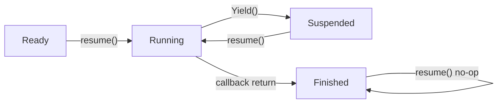

# 协程模型和 hook 调试文档

本文记录当前最小协程实现、IO hook 边界，以及 Reactor 如何恢复等待 IO 或 Timer 的协程。

## 当前组成

- `Coroutine`：用户态协程对象，拥有独立栈和 `coctx` 寄存器上下文。
- `CoroutinePool`：固定容量协程对象池，复用 `Coroutine` 对象及其栈空间，不负责调度。
- `FixedMemoryPool`：固定大小 block 内存池，可作为协程栈池的基础能力。
- `coctx_swap.S`：x86-64 汇编上下文切换原语，负责保存当前寄存器并恢复目标协程寄存器。
- `read_hook()` / `write_hook()`：协程感知的读写封装，只在非主协程且非阻塞 fd 返回 `EAGAIN`、`EWOULDBLOCK` 或 `EINTR` 时挂起。
- `connect_hook()`：协程感知的非阻塞连接封装，等待 `EPOLLOUT` 或 Timer 超时后恢复协程。
- `recv_hook()` / `send_hook()` / `accept_hook()`：socket 专用 hook，保留 `recv(2)` / `send(2)` 的 flags 参数和 `accept(2)` 的地址输出，并支持等待事件超时。
- `sleep_hook()` / `usleep_hook()`：协程感知的睡眠封装，子协程中通过 Reactor Timer 恢复，不阻塞 Reactor 线程。
- `FdEvent`：保存 fd、epoll 监听事件、普通回调，以及一个非拥有的 `Coroutine*`。
- `Reactor`：等待 epoll 事件；当事件匹配 `FdEvent` 上协程等待的事件时，恢复该协程。
- `TcpConnection`：在连接读写协程里调用 `read_hook()` 和 `write_hook()`，形成 input、execute、output 的服务端路径。

## 协程如何创建

`Coroutine` 构造函数接收一个 `std::function<void()>` 作为协程入口，并分配默认 128KB 独立栈。

创建子协程时会懒初始化当前线程的主协程：

- `t_mainCoroutine` 是线程局部主协程，ID 固定为 `0`。
- `t_curCoroutine` 是线程局部当前协程指针。
- 子协程 ID 从 `1` 开始递增。
- 子协程栈顶按 16 字节对齐。
- `coctx.regs[kRETAddr]` 指向 `Coroutine::CoFunc`。
- `coctx.regs[kRDI]` 保存 `this`，作为 `CoFunc(Coroutine*)` 的第一个参数。

首次调用 `resume()` 时，主协程通过 `coctx_swap(&(t_mainCoroutine->m_coctx), &(m_coctx))` 切到子协程。汇编恢复子协程上下文后进入 `CoFunc()`，再执行用户回调。

## Coroutine 状态

当前状态枚举为：

- `Ready`：已创建，尚未执行。
- `Running`：正在协程回调中执行。
- `Suspended`：调用 `Coroutine::Yield()` 后挂起，等待再次 `resume()`。
- `Finished`：用户回调执行完毕。

状态转换：



当前实现只支持同一线程内切换，不支持把协程迁移到另一个线程恢复。

## 协程复用

`Coroutine::reset(cb)` 用于复用已经 `Finished` 或尚未运行的 `Ready` 协程：

- reset 会替换入口回调。
- reset 会重新初始化 `coctx`，下一次 `resume()` 会重新从 `CoFunc(this)` 开始执行。
- reset 不会释放或重新分配栈空间。
- `Running` 和 `Suspended` 状态仍保存着有效执行现场，reset 会返回 false。

`CoroutinePool` 是固定容量池：

- `getCoroutine(cb)` 优先复用空闲协程，没有空闲协程时按容量创建新协程。
- 如果已创建数量达到容量上限，`getCoroutine(cb)` 返回 `nullptr`，不隐式扩容。
- `returnCoroutine(co)` 只接受 `Ready` 或 `Finished` 状态的协程。
- 归还成功时池会把协程 reset 成空任务，避免旧回调捕获继续留在池中。
- 当前池不做调度、不做 work stealing，也不跨线程迁移协程。

## 固定块内存池

`FixedMemoryPool` 是任务七十三引入的独立基础能力：

- 构造时预分配固定数量 block。
- `allocate()` 从空闲列表借出一个 block；池耗尽时返回 `nullptr`。
- `deallocate(ptr)` 只接受本池 block，拒绝 `nullptr`、外部指针和重复归还。
- `owns(ptr)` 用于判断指针是否属于本池。
- 当前 `Coroutine` 构造仍直接使用 `malloc/free` 管理栈，暂不强制接入内存池，避免性能优化影响主链路。

## 何时 yield

显式让出：

- 用户代码在协程内部调用 `Coroutine::Yield()`。
- `Yield()` 只允许在非主协程中生效。
- 如果协程未结束，状态改为 `Suspended`。
- 当前协程指针切回主协程。
- 通过 `coctx_swap(&(co->m_coctx), &(t_mainCoroutine->m_coctx))` 回到主协程。

IO hook 让出：

- `read_hook()` 先调用 `::read(fd, buf, count)`。
- `write_hook()` 先调用 `::write(fd, buf, count)`。
- `recv_hook()` 先调用 `::recv(fd, buf, count, flags)`。
- `send_hook()` 先调用 `::send(fd, buf, count, flags)`。
- `accept_hook()` 先调用 `::accept(fd, addr, addrLen)`。
- `connect_hook()` 先调用 `::connect(fd, addr, addrLen)`。
- `sleep_hook()` 和 `usleep_hook()` 在主协程中直接调用原始 `::sleep()` / `::usleep()`。
- 如果当前在主协程中，hook 直接返回系统调用结果。
- 如果系统调用成功，hook 直接返回结果。
- 如果系统调用失败且错误不是 `EAGAIN`、`EWOULDBLOCK` 或 `EINTR`，hook 直接返回错误。
- 如果当前在非主协程且遇到上述可等待错误，hook 会把当前协程挂到 `FdEvent`，注册等待事件，再调用 `Coroutine::Yield()`。
- `connect_hook()` 遇到 `EINPROGRESS`、`EALREADY` 或 `EINTR` 时等待 `EPOLLOUT`；设置 timeout 后还会注册一个一次性 `TimerEvent`。
- `recv_hook()` 和 `accept_hook()` 等待 `EPOLLIN`；`send_hook()` 等待 `EPOLLOUT`；设置 timeout 后会注册一个一次性 `TimerEvent`。
- `sleep_hook()` 和 `usleep_hook()` 在非主协程中向传入 Reactor 的 Timer 添加一次性 `TimerEvent`，随后 `Yield()`。

## 何时 resume

手动恢复：

- 测试或业务代码可以直接调用 `co.resume()`。
- `resume()` 只能从主协程恢复子协程。
- 已经 `Finished` 的协程再次 `resume()` 会直接返回。

Reactor 恢复：

1. hook 遇到可等待错误后调用 `fdEvent->setCoroutine(Coroutine::GetCurrentCoroutine())`。
2. hook 通过 `setCoroutineListenEvent(EPOLLIN)` 或 `setCoroutineListenEvent(EPOLLOUT)` 记录等待事件。
3. hook 将对应事件加入 `FdEvent::m_listenEvents`。
4. 如果 `FdEvent` 已有关联 Reactor，则调用 `registerToReactor()` 或 `updateToReactor()`。
5. Reactor 的 `waitOnce()` 调用 `epoll_wait()`。
6. epoll 返回后，Reactor 从 `event.data.ptr` 取回 `FdEvent*`。
7. 如果 `FdEvent` 上有协程，且触发事件匹配协程等待事件，Reactor 先 `clearCoroutine()`，再 `coroutine->resume()`。
8. 协程从 hook 内部的 `Coroutine::Yield()` 返回，hook 再次调用原始系统调用并返回结果。

`connect_hook()` 的恢复结果略有不同：协程恢复后不会再次调用 `connect()`，而是通过 `getsockopt(SO_ERROR)` 读取非阻塞 connect 的最终结果。`SO_ERROR == 0` 表示连接成功；非 0 表示连接拒绝等内核错误；Timer 到期恢复时返回 `-1` 并设置 `errno = ETIMEDOUT`。

`recv_hook()`、`send_hook()` 和 `accept_hook()` 被事件恢复后会重试一次原始系统调用。Timer 到期恢复时不再重试，直接返回 `-1` 并设置 `errno = ETIMEDOUT`。

`sleep_hook()` 和 `usleep_hook()` 的恢复路径由 `TimerEvent` 触发。Timer 到期后回调在 Reactor 线程中调用 `coroutine->resume()`；协程从 `Yield()` 返回后删除对应 TimerEvent，随后 hook 返回成功。当前实现不处理信号中断剩余时间，Timer 正常恢复后固定返回 `0`。

## hook 如何找到当前 Reactor

hook 不做全局查找，也不从线程局部对象推断 Reactor。当前模型是显式传入 Reactor 相关对象：

- `TcpConnection` 持有 `m_fdEvent`。
- `TcpConnection::startConnection()` 把连接 fd 注册到连接所属 Reactor。
- `read_hook(&m_fdEvent, ...)` 和 `write_hook(&m_fdEvent, ...)` 通过 `fdEvent->getReactor()` 获取 Reactor。
- `connect_hook(&fdEvent, ...)` 同样通过传入的 `FdEvent` 获取 Reactor 和 Timer。
- `recv_hook(&fdEvent, ...)`、`send_hook(&fdEvent, ...)` 和 `accept_hook(&fdEvent, ...)` 同样通过 `FdEvent` 获取 Reactor 和 Timer。
- `sleep_hook(&reactor, ...)` 和 `usleep_hook(&reactor, ...)` 直接通过显式传入的 `Reactor*` 获取 Timer。
- 如果 `getReactor()` 为 `nullptr`，hook 只挂载协程和事件标记，不会自动注册 epoll。

这意味着 hook 的调用方必须保证 `FdEvent` 已经正确关联目标 Reactor。测试里也会显式 `readEvent.setReactor(&reactor)`。

## hook 关闭时走什么路径

当前没有全局 hook 开关。hook 的“关闭路径”体现在两种情况：

- 当前在主协程：`Coroutine::IsMainCoroutine()` 为 true，`read_hook()` / `write_hook()` 直接透传 `::read()` / `::write()`。
- `recv_hook()` / `send_hook()` / `accept_hook()` 在主协程中直接透传原始 socket 系统调用。
- `sleep_hook()` / `usleep_hook()` 在主协程中直接透传 `::sleep()` / `::usleep()`。
- 系统调用已经成功或返回不可等待错误：hook 不挂协程、不注册 Reactor，直接把系统调用结果返回给上层。

因此主协程、阻塞 fd 成功路径、真实错误路径都不会进入协程挂起逻辑。

## TcpConnection 读写路径

`TcpConnection::coroutineReadLoop()` 是当前服务端协程读写入口：

1. `input()` 循环调用 `read_hook()`。
2. 读到字节后追加到 `m_inputBuffer`，刷新活跃时间。
3. `execute()` 根据 codec 解码请求，交给 dispatcher，或在无 dispatcher 时回环编码。
4. `output()` 循环调用 `write_hook()` 把 `m_outputBuffer` 写回 socket。
5. 输出写空后删除 `EPOLLOUT`，避免可写事件空转。

读到 `0` 表示对端关闭，连接会执行 `closeWithCallback()`。读写遇到不可恢复错误时也会关闭连接。

## 当前边界

- 已实现 `read_hook()`、`write_hook()`、`connect_hook()`、`recv_hook()`、`send_hook()`、`accept_hook()`、`sleep_hook()` 和 `usleep_hook()`。
- `recv_hook()` / `send_hook()` / `accept_hook()` 只覆盖常见非阻塞 socket 等待语义，不覆盖所有 flags 组合。
- 当前 hook API 需要调用方传入 `FdEvent*`，不是 libc 符号级全局替换。
- `sleep_hook()` / `usleep_hook()` 需要显式传入 `Reactor*`，不是 libc 符号级全局替换。
- 当前 `FdEvent` 只保存非拥有的 `Coroutine*`，协程生命周期仍由调用方管理。
- 已实现固定容量 `CoroutinePool`；池耗尽时返回 `nullptr`，不隐式新建超过容量的协程。
- 已实现独立 `FixedMemoryPool`；暂未接入 `Coroutine` 栈分配策略。

## 调试清单

- 协程没有恢复：检查 `FdEvent::getCoroutine()` 是否非空，`getCoroutineListenEvent()` 是否与触发事件匹配。
- Reactor 没收到事件：检查 `FdEvent::getReactor()` 是否已设置，`isRegistered()` 是否为 true，`getListenEvents()` 是否包含目标事件。
- hook 没有 yield：确认当前不在主协程，并且 fd 是非阻塞 fd，系统调用实际返回 `EAGAIN` / `EWOULDBLOCK`。
- connect hook 没有按预期超时：检查 `FdEvent` 是否已设置 Reactor，且 Reactor 内部 Timer 是否存在。
- sleep/usleep hook 没有恢复：检查传入的 `Reactor*` 是否非空，`reactor->getTimer()` 是否可用，TimerEvent 是否成功加入 Timer。
- 恢复后仍然失败：hook 恢复后只重试一次系统调用，若 fd 状态仍不可用，会把结果直接返回给上层。
- fd 关闭后异常：关闭 fd 前应先从 Reactor 注销对应 `FdEvent`，避免 epoll 持有已关闭 fd 的旧事件对象。

## 验证命令

```bash
./build.sh
./build/test_coroutine
./build/test_coroutine_pool
./build/test_memory_pool
./build/test_hook
./build/test_hook_sleep
./build/test_hook_socket
./scripts/check_rpc_sync.sh
```
