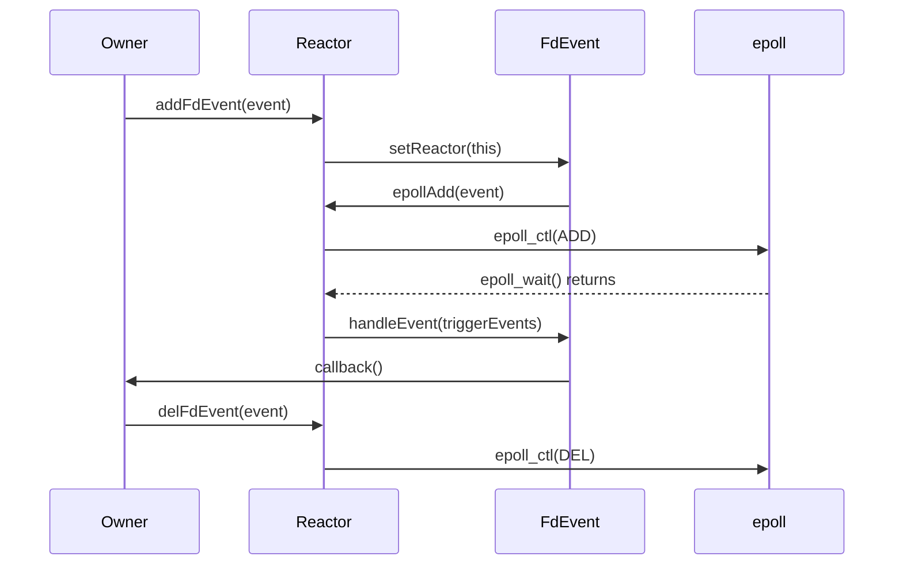
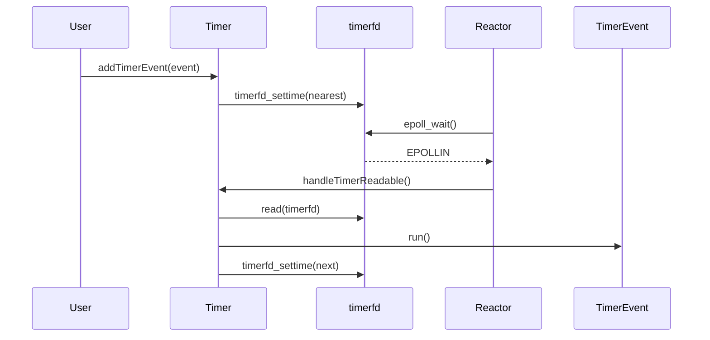
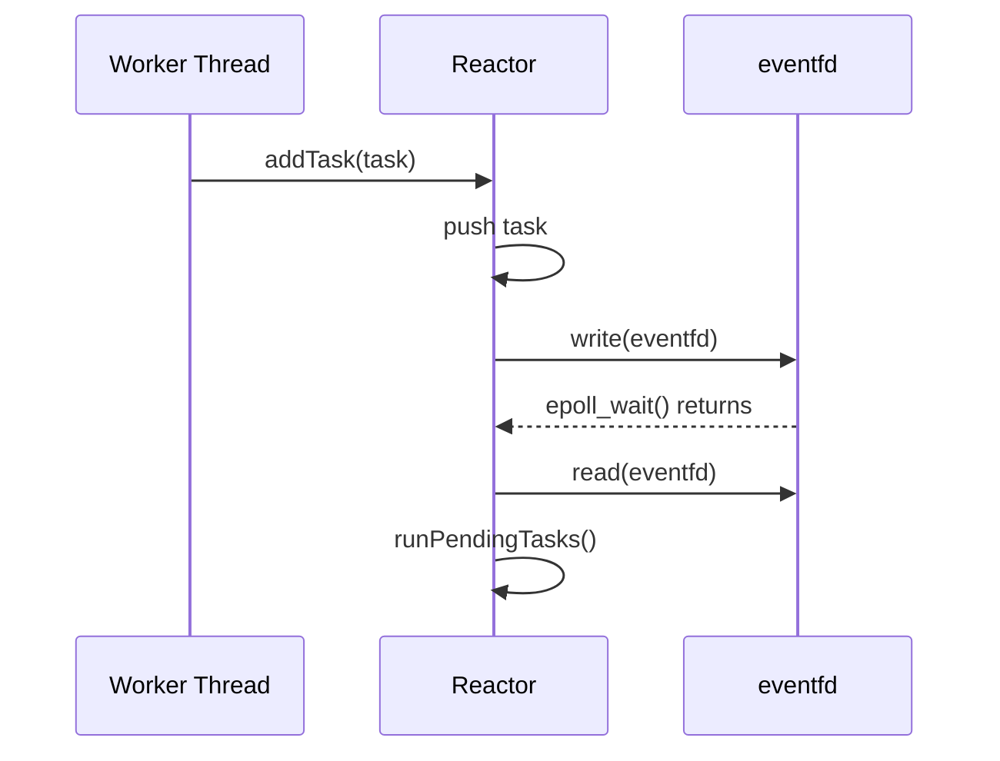

# Reactor 事件生命周期调试文档

本文记录阶段 10 结束时 Reactor 相关事件的线程归属和生命周期，用于后续 IOThread 与多 Reactor 阶段排查问题。

## 一、核心对象关系

- `Reactor` 拥有 `epoll fd`、`Timer`、wakeup `eventfd` 和 fd 到 `FdEvent*` 的注册表。
- `FdEvent` 不拥有 fd，只保存 fd、监听事件、回调函数和可选协程指针。
- `Timer` 拥有 `timerfd`，通过内部 `FdEvent` 注册到 Reactor。
- wakeup fd 由 Reactor 自己拥有，用于跨线程唤醒 `epoll_wait()` 并执行 task queue。

## 二、fd event 注册与删除

调试要点：

- 同一个 `FdEvent` 重复注册是幂等成功。
- 不同 `FdEvent` 重复注册同一个 fd 会被拒绝。
- `epollMod()` 和 `epollDel()` 只允许当前 fd 的 owner event 操作。
- 删除事件后再关闭 fd，避免 epoll 中残留已关闭 fd。

## 三、callback 线程归属

| callback 类型 | 执行线程 | 说明 |
|---|---|---|
| 普通 fd read/write callback | 调用 `waitOnce()` 或 `loop()` 的线程 | 当前阶段通常就是单 Reactor 线程 |
| Timer callback | Reactor 线程 | timerfd 可读后由 Reactor 调用 Timer 内部回调 |
| wakeup task | Reactor 线程 | 其他线程只负责 `addTask()` 和写 eventfd |
| 协程恢复 | Reactor 线程 | fd 就绪并匹配等待事件后调用 `Coroutine::resume()` |

## 四、timerfd 触发路径

调试要点：

- `TimerEvent` 本身只是内存对象，不直接操作 fd。
- `Timer` 每次添加、删除、执行事件后都会刷新最近到期时间。
- 一次性事件执行后会 cancel 并移除。
- 重复事件执行后会重置下一次到期时间。

## 五、wakeup 与 task queue

调试要点：

- `addTask()` 可以从其他线程调用。
- task 不在提交线程执行，而是在 Reactor 线程执行。
- `stop()` 通过同一个 wakeup fd 唤醒阻塞中的 `loop()`。
- fd callback 中调用 `stop()` 不会死锁，当前 callback 返回后 loop 退出。

## 六、常见问题定位

1. callback 没有触发：
   检查 `FdEvent` 是否注册成功、监听事件是否包含目标事件、fd 是否仍有效。

2. 删除 fd 后仍触发：
   检查关闭 fd 前是否调用 `delFdEvent()` 或 `unregisterFromReactor()`。

3. task 没有执行：
   检查 Reactor 是否仍在 `waitOnce()` 或 `loop()` 中，以及 wakeup fd 是否注册成功。

4. timer 不触发：
   检查 `TimerEvent` 是否已 cancel、最近到期时间是否被 `timerfd_settime()` 刷新。
