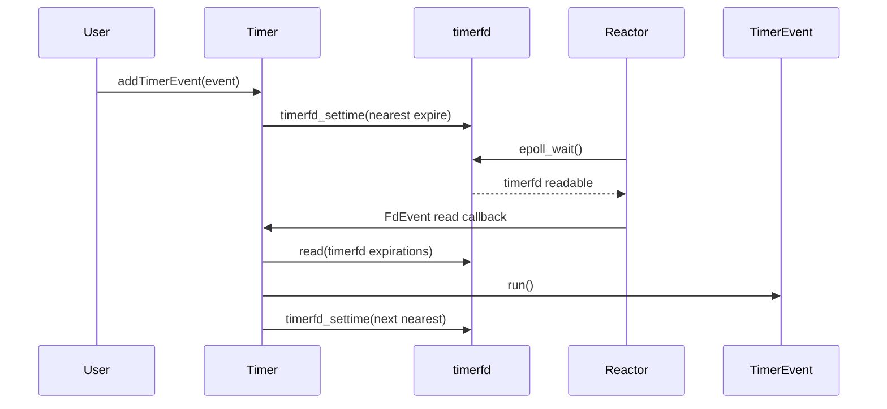
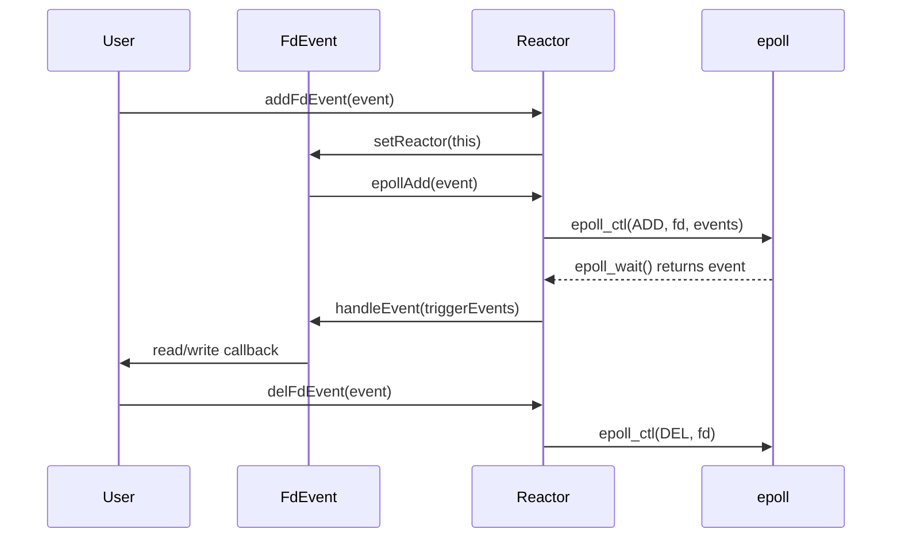
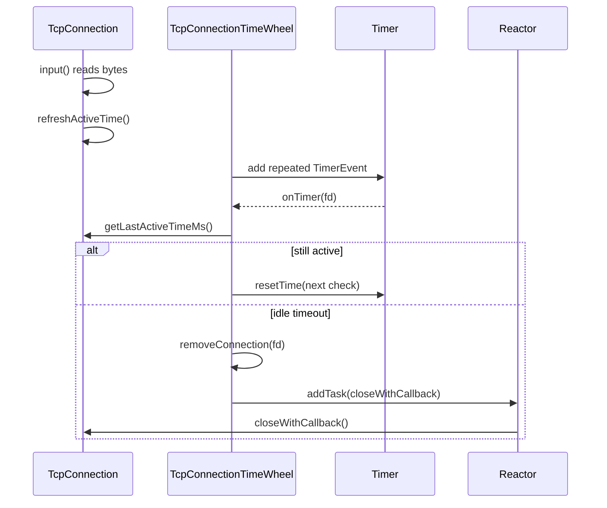

# 阶段 10：Timer、Reactor wakeup 和连接生命周期

阶段 10 的目标是让 Reactor 从只处理 fd 事件，逐步升级到可以处理时间事件、跨线程任务投递和安全退出。本阶段会先完成内存级 TimerEvent，再接入 timerfd，最后补齐 wakeup、stop 和连接生命周期文档。

## 任务四十七：`TimerEvent` 与基础时间函数

已完成能力：

- 新增 `getNowMs()`，返回当前毫秒时间，用作定时任务到期时间基准。
- 新增 `TimerEvent`，描述一个内存级定时任务。
- 支持一次性任务：`run()` 后执行 callback 并进入 canceled 状态。
- 支持重复任务：`run()` 后执行 callback，并刷新下一次到期时间。
- 支持 `cancel()`：取消后 `run()` 不再执行 callback。
- 支持 `resetTime()`：按原 interval 或新 interval 刷新到期时间，并清除 canceled 状态。

## 当前边界

- `TimerEvent` 只描述任务本身，不创建 `timerfd`。
- `TimerEvent` 不注册到 Reactor，也不负责调度顺序。
- 到期判断由 `isExpired(nowMs)` 提供，真正的到期扫描和执行留给后续 `Timer`。
- `run()` 不主动检查当前时间是否已到期；调用方必须只在确认到期后调用。

## 任务四十八：`Timer` + `timerfd` 接入 Reactor

已完成能力：

- 新增 `Timer`，内部创建 Linux `timerfd`。
- `Reactor` 构造时持有一个 `Timer`，并通过 `getTimer()` 暴露给调用方。
- `Timer` 用 `FdEvent` 将 `timerfd` 注册到 Reactor。
- 添加定时任务后，`Timer` 会用最近到期任务刷新 `timerfd_settime()`。
- `timerfd` 可读时，Reactor 像处理普通 fd 一样调用 Timer 的读回调。
- 支持一次性任务到期执行后删除。
- 支持重复任务到期后刷新下一次到期时间。
- 支持删除任务后解除或刷新最近到期时间。
- 支持多个任务按到期时间执行。

## timerfd 触发路径



## Timer 当前边界

- 只实现最小顺序扫描，不做时间轮或堆优化。
- 不做协程 sleep hook。
- 不接入 TcpConnection 空闲超时。
- Timer callback 在调用 `Reactor::waitOnce()` 的线程执行。

## 任务四十九：Reactor 任务队列和 wakeup fd

已完成能力：

- `Reactor::addTask()` 支持从其他线程投递任务。
- Reactor 内部使用 `eventfd` 作为 wakeup fd。
- `addTask()` 会写入 eventfd，使阻塞中的 `epoll_wait()` 被唤醒。
- wakeup 回调在 Reactor 线程中读取 eventfd 并执行待处理任务队列。
- 多个任务按提交顺序执行。
- `stop()` 设置停止标记并写入 wakeup fd，可以在没有网络事件时唤醒 `loop()` 并退出。

## wakeup 任务投递路径

```mermaid
sequenceDiagram
    participant Worker as Worker Thread
    participant Reactor as Reactor
    participant Wakeup as eventfd
    participant Loop as Reactor Loop

    Worker->>Reactor: addTask(callback)
    Reactor->>Reactor: push pending task
    Reactor->>Wakeup: write(eventfd, 1)
    Loop->>Wakeup: epoll_wait() returns readable
    Loop->>Reactor: handleWakeup()
    Reactor->>Wakeup: read(eventfd counter)
    Reactor->>Reactor: runPendingTasks()
```

## Reactor 当前线程归属

- fd callback 在调用 `waitOnce()` 或 `loop()` 的 Reactor 线程执行。
- Timer callback 在 Reactor 线程执行。
- `addTask()` 的 task 在 Reactor 线程执行，而不是提交线程执行。
- `stop()` 可从其他线程调用，退出动作在 Reactor 线程下一次 wakeup 后完成。

## 任务五十：Reactor 安全退出和事件生命周期回归

已完成能力：

- 新增 `Reactor::addFdEvent()` 和 `Reactor::delFdEvent()`，作为外部注册/删除 fd event 的语义入口。
- `addFdEvent()` 会把事件绑定到当前 Reactor，再交给 `FdEvent::registerToReactor()` 注册。
- 同一个 `FdEvent` 重复调用 `registerToReactor()` 是幂等成功，不会再次调用 `epoll_ctl(ADD)`。
- 不同 `FdEvent` 重复注册同一个 fd 会被 Reactor 拒绝，避免 epoll `data.ptr` 所属对象被悄悄覆盖。
- `delFdEvent()` 只允许注册该 fd 的 owner event 删除；非 owner 删除会失败。
- fd callback 中可以直接调用 `stop()`，loop 会在当前回调返回后退出，不需要额外网络事件唤醒。
- `test_reactor` 覆盖 fd 注册、可读回调、删除后不触发、重复 fd 注册、跨线程任务投递、任务顺序和 callback 内 stop。

## fd event 生命周期



## Reactor 事件生命周期边界

- fd 的关闭仍由创建该 fd 的上层对象负责，Reactor 只负责从 epoll 中注册或删除。
- 删除事件前应先调用 `delFdEvent()` 或 `FdEvent::unregisterFromReactor()`，再关闭 fd。
- `Reactor` 不拥有业务 `FdEvent` 对象，只保存非拥有指针；业务对象需要保证注册期间自身存活。
- 当前阶段仍是单 Reactor 模型，不做多 Reactor 线程归属迁移。

## 任务五十一：连接空闲超时 / 简化时间轮

已完成能力：

- 新增 `TcpConnectionTimeWheel`，用简化方式管理连接空闲超时。
- 每条连接注册一个重复 `TimerEvent`，Timer 到期后检查连接最后活跃时间。
- `TcpConnection` 新增 `refreshActiveTime()` 和 `getLastActiveTimeMs()`，读到真实数据时刷新活跃时间。
- 连接活跃刷新后，时间轮会重置检查时间，避免误关活跃连接。
- 连接真正空闲超过阈值后，时间轮先从内部表移除连接，再通过 `Reactor::addTask()` 把关闭动作投递回所属 Reactor。
- `TcpConnection` 新增 `isClosed()`，测试和后续生命周期管理可明确观察关闭状态。
- `test_tcp_timewheel` 覆盖活跃连接刷新、空闲连接关闭并移除、关闭 callback 在线程归属明确的 Reactor loop 线程执行。

## TcpConnection 空闲超时路径



## TcpConnection 空闲超时边界

- 当前实现是每连接一个 TimerEvent 的简化时间轮，不做分层 bucket，不追求高并发性能优化。
- 时间轮不拥有连接对象，只保存 `weak_ptr`；连接提前销毁或关闭时，下一次 timer 检查会清理记录。
- 关闭 fd 的动作通过 Reactor task 执行，避免其他线程直接关闭连接所属 fd。
- 当前 `TcpServer` 还未默认接入空闲超时，后续多 Reactor 阶段再统一接入服务端连接管理。

## 任务五十二：Reactor / Timer / TcpConnection 调试文档

已完成能力：

- 新增 [Reactor 事件生命周期调试文档](reactor-event-lifecycle.md)，集中记录 fd event、timerfd、wakeup、stop 和 callback 线程归属。
- 新增 [TcpConnection 生命周期调试文档](tcpconnection-lifetime.md)，集中记录连接创建、读写、关闭、空闲超时和 fd 归属。
- 本文保留阶段 10 的主线说明；独立文档作为后续多 Reactor、IOThread 和异步 RPC 排查问题的入口。

## 阶段 10 调试索引

| 问题 | 优先查看 |
|---|---|
| fd callback 在哪个线程执行 | `reactor-event-lifecycle.md` 的 callback 线程归属 |
| fd 注册后不触发或删除后仍触发 | `reactor-event-lifecycle.md` 的 fd event 注册与删除 |
| Timer 不触发或重复触发异常 | `reactor-event-lifecycle.md` 的 timerfd 触发路径 |
| `addTask()` 不执行或 `stop()` 不退出 | `reactor-event-lifecycle.md` 的 wakeup 与 task queue |
| 连接对象由谁持有、fd 由谁关闭 | `tcpconnection-lifetime.md` 的对象和 fd 归属 |
| 空闲超时是否跨线程直接关 fd | `tcpconnection-lifetime.md` 的空闲超时路径 |

## 验证命令

```bash
./build.sh
./build/test_timer_event
./build/test_timer
./build/test_reactor
./build/test_tcp_timewheel
./scripts/check_rpc_sync.sh
```
