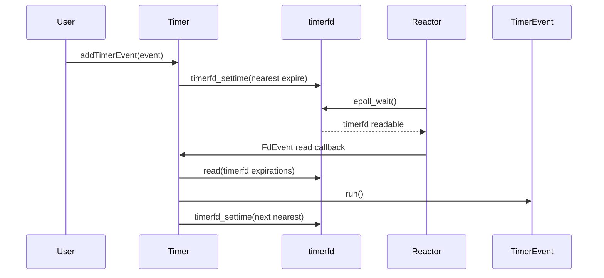

# 阶段 10：Timer、Reactor wakeup 和连接生命周期

阶段 10 的目标是让 Reactor 从只处理 fd 事件，逐步升级到可以处理时间事件、跨线程任务投递和安全退出。本阶段会先完成内存级 TimerEvent，再接入 timerfd，最后补齐 wakeup、stop 和连接生命周期文档。

## 任务四十七：`TimerEvent` 与基础时间函数

已完成能力：

- 新增 `getNowMs()`，返回当前毫秒时间，用作定时任务到期时间基准。
- 新增 `TimerEvent`，描述一个内存级定时任务。
- 支持一次性任务：`run()` 后执行 callback 并进入 canceled 状态。
- 支持重复任务：`run()` 后执行 callback，并刷新下一次到期时间。
- 支持 `cancel()`：取消后 `run()` 不再执行 callback。
- 支持 `resetTime()`：按原 interval 或新 interval 刷新到期时间，并清除 canceled 状态。

## 当前边界

- `TimerEvent` 只描述任务本身，不创建 `timerfd`。
- `TimerEvent` 不注册到 Reactor，也不负责调度顺序。
- 到期判断由 `isExpired(nowMs)` 提供，真正的到期扫描和执行留给后续 `Timer`。
- `run()` 不主动检查当前时间是否已到期；调用方必须只在确认到期后调用。

## 任务四十八：`Timer` + `timerfd` 接入 Reactor

已完成能力：

- 新增 `Timer`，内部创建 Linux `timerfd`。
- `Reactor` 构造时持有一个 `Timer`，并通过 `getTimer()` 暴露给调用方。
- `Timer` 用 `FdEvent` 将 `timerfd` 注册到 Reactor。
- 添加定时任务后，`Timer` 会用最近到期任务刷新 `timerfd_settime()`。
- `timerfd` 可读时，Reactor 像处理普通 fd 一样调用 Timer 的读回调。
- 支持一次性任务到期执行后删除。
- 支持重复任务到期后刷新下一次到期时间。
- 支持删除任务后解除或刷新最近到期时间。
- 支持多个任务按到期时间执行。

## timerfd 触发路径



## Timer 当前边界

- 只实现最小顺序扫描，不做时间轮或堆优化。
- 不做协程 sleep hook。
- 不接入 TcpConnection 空闲超时。
- Timer callback 在调用 `Reactor::waitOnce()` 的线程执行。

## 验证命令

```bash
./build.sh
./build/test_timer_event
./build/test_timer
./scripts/check_rpc_sync.sh
```
