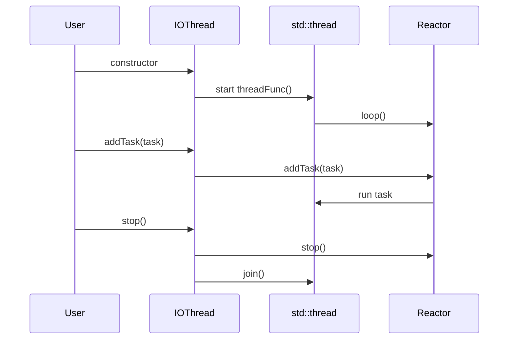
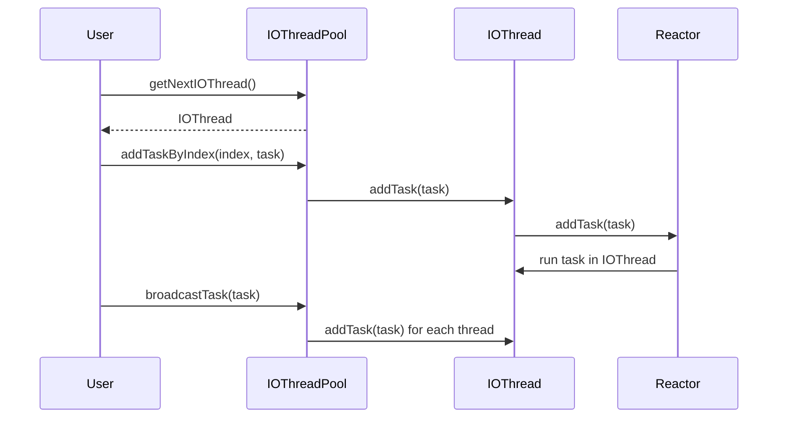
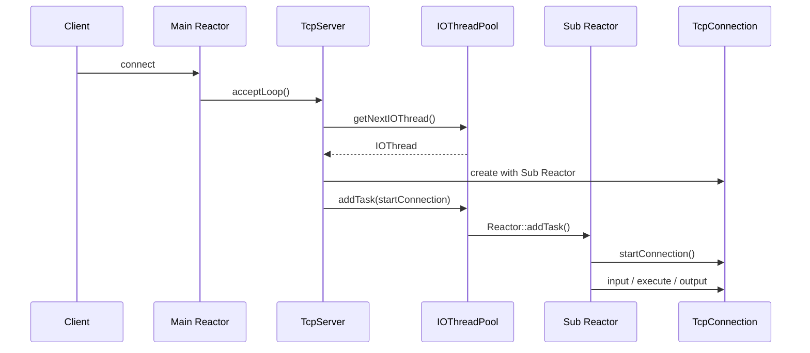

# 阶段 11：IOThread 与服务端多 Reactor

阶段 11 的目标是把当前单 Reactor 模型推进到 Main Reactor accept、Sub Reactor 处理连接读写的服务端模型。本阶段会先补基础线程工具，再实现 IOThread、IOThreadPool，最后让 TcpServer 可以把新连接分发到 Sub Reactor。

## 任务五十三：`Mutex`、`RWMutex` 和基础线程工具

已完成能力：

- 新增 `Mutex`，封装 `std::mutex`。
- 新增 `MutexLockGuard`，用 RAII 方式进入和退出互斥区。
- 新增 `RWMutex`，封装 `std::shared_mutex`。
- 新增 `ReadLockGuard` 和 `WriteLockGuard`，分别封装共享读锁和独占写锁。
- 新增 `test_mutex`，覆盖多线程递增、多读并发进入、写锁独占递增。

## 当前边界

- 当前锁工具只做最小封装，不复刻原项目复杂锁实现。
- 不做无锁结构。
- 暂未替换 Reactor 内部已有 `std::mutex`，后续 IOThreadPool 需要统一风格时再逐步调整。

## 任务五十四：`IOThread` 生命周期

已完成能力：

- 新增 `IOThread`，内部持有一个 `Reactor`。
- `IOThread` 构造时启动后台线程，并在线程函数中进入 `Reactor::loop()`。
- 提供 `getReactor()`，后续 TcpServer 和 IOThreadPool 可拿到线程所属 Reactor。
- 提供 `addTask()`，把任务投递到 IOThread 内部 Reactor，由 IOThread 所在线程执行。
- 提供 `stop()`，可唤醒 Reactor 并 join 后台线程。
- 析构函数会兜底调用 `stop()`，避免线程泄漏。
- 新增 `test_iothread`，覆盖线程启动、任务线程归属、stop 幂等和析构安全。

## IOThread 生命周期路径



## IOThread 当前边界

- 当前 `IOThread` 不直接接入 `TcpServer`，只提供单线程单 Reactor 能力。
- 不管理多个线程；线程池在任务五十五实现。
- 不提供动态重启语义，`stop()` 后当前对象视为已停止。

## 任务五十五：`IOThreadPool`

已完成能力：

- 新增 `IOThreadPool`，构造时启动固定数量的 `IOThread`。
- `getNextIOThread()` 按 round-robin 返回下一个线程。
- `getIOThreadByIndex()` 支持按下标获取指定线程。
- `broadcastTask()` 会向每个 IOThread 各投递一次任务。
- `addTaskByIndex()` 支持向指定 index 的线程投递任务，非法 index 返回失败。
- `stop()` 会停止池内全部线程，析构时兜底调用。
- 新增 `test_iothreadpool`，覆盖轮转、broadcast、指定 index 投递和线程归属。

## IOThreadPool 任务投递路径



## IOThreadPool 当前边界

- 线程数量固定，暂不支持动态扩缩容。
- round-robin 只按调用次数轮转，不做负载感知。
- 当前尚未接入 `TcpServer`，任务五十六会处理新连接分发。

## 任务五十六：`TcpServer` 接入 IOThreadPool

已完成能力：

- `TcpServer` 新增 `setIOThreadNum()`，可选择启用 Sub Reactor 线程池。
- 未设置 IOThread 数量时保持旧单 Reactor 模式。
- 启用 IOThreadPool 后，Main Reactor 只负责监听 fd 和 accept。
- accept 到新连接后，`TcpServer` 按 IOThreadPool round-robin 选择一个 Sub Reactor。
- `TcpConnection` 使用 Sub Reactor 创建，`startConnection()` 投递到目标 IOThread 执行。
- 连接关闭回调会回到 `TcpServer::removeConnection()`，连接表使用 `Mutex` 保护。
- 新增 `scripts/check_stage11_server.sh`，启动多 Reactor TinyPB server 并并发运行 8 个 Stub 客户端。

## TcpServer 多 Reactor 分发路径



## TcpServer 多 Reactor 当前边界

- 当前只做固定线程数和 round-robin 分发，不做动态扩缩容。
- `TcpServer` 单线程模式仍可用，阶段 8 同步 RPC 回归继续覆盖旧路径。
- 连接表已加锁，但连接对象内部仍假定由所属 Reactor 线程驱动。
- 关闭服务器仍依赖测试脚本杀进程，尚未实现独立 stop API。

## 任务五十七：`TcpConnection` 所有权和状态机文档

已完成能力：

- 完善 `docs/tcpconnection-lifetime.md`，把阶段 11 的单 Reactor 和多 Reactor 两种路径放在同一份生命周期文档中。
- 明确连接对象主要由 `TcpServer::m_connections` 持有，读协程和 IOThread 投递任务只临时捕获 `shared_ptr` 保活。
- 明确 fd 由 `TcpConnection::closeConnection()` 关闭，`FdEvent` 和 `Reactor` 都不拥有 fd。
- 明确 Main Reactor 负责监听 fd 和 accept；多 Reactor 模式下，连接注册、读写、codec、dispatcher 和关闭动作都在连接所属 Sub Reactor 线程执行。
- 明确 input buffer、output buffer、codec 和 dispatcher 的关系：buffer 归 `TcpConnection` 所有，dispatcher 只处理协议对象并写入响应，不拥有连接资源。
- 补充关闭和析构边界：`closeConnection()` 幂等，析构由最后一个 `shared_ptr` 释放线程触发，正常关闭路径围绕所属 Reactor 线程执行。

## TcpConnection 阶段 11 线程归属速查

| 动作 | 单 Reactor 模式 | 多 Reactor 模式 |
| --- | --- | --- |
| accept 新连接 | Main Reactor 线程 | Main Reactor 线程 |
| 创建 `TcpConnection` | Main Reactor 线程 | Main Reactor 线程 |
| 写入连接表 | Main Reactor 线程 | Main Reactor 线程，使用 `Mutex` 保护 |
| 注册连接 fd | Main Reactor 线程 | 目标 Sub Reactor 线程 |
| 读写协程恢复 | Main Reactor 线程 | 目标 Sub Reactor 线程 |
| dispatcher 调用 | Main Reactor 线程 | 目标 Sub Reactor 线程 |
| close callback 删除连接表 | Main Reactor 线程 | 目标 Sub Reactor 线程，使用 `Mutex` 保护 |
| fd 关闭 | `TcpConnection::closeConnection()` | `TcpConnection::closeConnection()` |

## TcpConnection 文档当前边界

- 当前任务只补齐所有权和状态机文档，不做内存池优化。
- `TcpServer` 仍未提供正式 stop API，阶段验收脚本继续通过结束 server 进程完成清理。
- 空闲超时管理器仍是独立能力，尚未默认接入 `TcpServer`。

## 验证命令

```bash
./build.sh
./build/test_mutex
./build/test_iothread
./build/test_iothreadpool
./scripts/check_stage11_server.sh
./scripts/check_rpc_sync.sh
```
