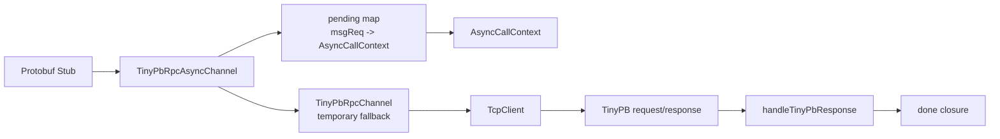

# 阶段 15：异步 RPC Channel

阶段 15 的目标是从同步 Stub 调用升级到异步 RPC 调用：先明确 request、response、controller 和 closure 的生命周期，再逐步接入 pending map、IOThread/Reactor、超时和取消。

## 任务七十四：异步 Channel 生命周期外壳

已完成能力：

- 新增 `TinyPbRpcAsyncChannel`，继承 `google::protobuf::RpcChannel`。
- 新增 `AsyncCallContext`，保存本次调用的 `msgReq`、method 全名、controller、request、response 和 closure。
- `CallMethod()` 会在参数合法时生成或复用 controller 中的 `msgReq`。
- 当前外壳内部临时复用 `TinyPbRpcChannel` 完成同步 TinyPB 网络请求。
- 成功路径和失败路径都会由同步 Channel 执行 `done` closure。
- 新增 `test_tinypb_rpc_async_channel`，覆盖成功调用、网络失败仍执行 done、非法参数仍执行 done。

## 任务七十五：异步请求表和 msgReq 匹配

已完成能力：

- `TinyPbRpcAsyncChannel` 新增 `msgReq -> AsyncCallContext` pending 表。
- 参数合法且 request 序列化成功后，`CallMethod()` 会先注册 pending。
- 新增 `setSyncFallbackEnabled(false)` 测试入口，可只注册 pending，不走同步网络 fallback。
- 新增 `handleTinyPbResponse()`，按 response `msgReq` 命中上下文、移除 pending、反序列化业务 response 并执行 closure。
- 支持乱序响应：每个 response 只唤醒与其 `msgReq` 对应的 request。
- 未知 `msgReq` response 返回 `false` 并保留已有 pending。
- TinyPB 错误响应会设置 controller error 并执行 closure。

当前调用链：



## 当前边界

- 当前还不是真正并发异步网络 IO。
- pending map 只在 Channel 内部维护，不放回同步 `TcpClient`。
- 当前通过测试钩子模拟 response 到达，真实 response 读取留到 IOThread/Reactor 接入任务。
- 当前不做异步超时和取消。
- 当前 `AsyncCallContext` 保存非拥有指针，调用方仍需保证 request、response、controller 和 closure 在 `CallMethod()` 返回前有效。

## 验证命令

```bash
./build.sh
./build/test_tinypb_rpc_async_channel
./build/test_tinypb_rpc_channel
./scripts/check_rpc_sync.sh
```
