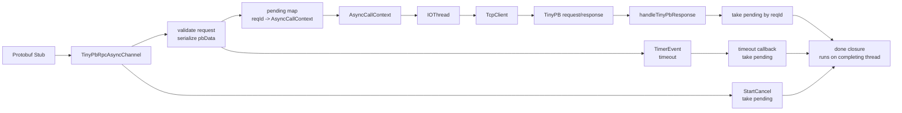

# 阶段 15：异步 RPC Channel

阶段 15 的目标是从同步 Stub 调用升级到异步 RPC 调用：先明确 request、response、controller 和 closure 的生命周期，再逐步接入 pending map、IOThread/Reactor、超时和取消。

## 任务七十四：异步 Channel 生命周期外壳

已完成能力：

- 新增 `TinyPbRpcAsyncChannel`，继承 `google::protobuf::RpcChannel`。
- 新增 `AsyncCallContext`，保存本次调用的 `reqId`、method 全名、controller、request、response 和 closure。
- `CallMethod()` 会在参数合法时生成或复用 controller 中的 `reqId`。
- 当前外壳内部临时复用 `TinyPbRpcChannel` 完成同步 TinyPB 网络请求。
- 成功路径和失败路径都会由同步 Channel 执行 `done` closure。
- 新增 `test_tinypb_rpc_async_channel`，覆盖成功调用、网络失败仍执行 done、非法参数仍执行 done。

## 任务七十五：异步请求表和 reqId 匹配

已完成能力：

- `TinyPbRpcAsyncChannel` 新增 `reqId -> AsyncCallContext` pending 表。
- 参数合法且 request 序列化成功后，`CallMethod()` 会先注册 pending。
- 新增 `setSyncFallbackEnabled(false)` 测试入口，可只注册 pending，不走同步网络 fallback。
- 新增 `handleTinyPbResponse()`，按 response `reqId` 命中上下文、移除 pending、反序列化业务 response 并执行 closure。
- 支持乱序响应：每个 response 只唤醒与其 `reqId` 对应的 request。
- 未知 `reqId` response 返回 `false` 并保留已有 pending。
- TinyPB 错误响应会设置 controller error 并执行 closure。

## 任务七十六：异步 Channel 接入 IOThread/Reactor

已完成能力：

- `TinyPbRpcAsyncChannel` 构造时持有一个 `IOThread`。
- 默认 `CallMethod()` 会在注册 pending 后把网络请求投递到 IOThread。
- IOThread 负责执行当前最小网络路径：使用 `TcpClient::sendAndRecvTinyPb()` 连接、发送请求并读取响应。
- response 返回后由 IOThread 调用 `handleTinyPbResponse()`，按 `reqId` 完成上下文并执行 closure。
- 网络失败时，IOThread 会删除 pending、设置 controller error 并执行 closure。
- `stop()` 可安全停止内部 IOThread，`getIOThreadId()` 可观察 closure 执行线程。
- `test_tinypb_rpc_async_channel` 覆盖 10 个异步请求全部完成，以及 closure 在线程归属上运行于 IOThread。

## 任务七十七：异步超时和取消

已完成能力：

- `AsyncCallContext` 新增 `timeoutEvent`，用于记录本次异步请求的超时事件。
- `TinyPbRpcAsyncChannel` 会读取 `TinyPbRpcController::Timeout()`，为 pending 请求注册一次性 `TimerEvent`。
- 超时事件挂到内部 IOThread 的 Reactor Timer；到期后从 pending map 删除上下文、设置 `ERROR_RPC_ASYNC_TIMEOUT` 并执行 closure。
- `handleTinyPbResponse()`、网络失败、超时和取消统一通过 pending map 做一次性完成仲裁，只有先取出 pending 的路径会执行 closure。
- 迟到 response 因 pending 已删除而返回 `false`，不会二次触发 closure。
- `TinyPbRpcController::StartCancel()` 会触发 Channel 注册的内部取消回调，删除 pending、设置 `ERROR_RPC_ASYNC_CANCELED` 并执行 closure。
- 请求完成后会取消对应 `TimerEvent` 并清理 controller 上的内部取消回调。
- `test_tinypb_rpc_async_channel` 覆盖超时清理、迟到响应不二次回调、controller 取消清理。

## 任务七十八：异步 RPC 调用链文档和回归脚本

已完成能力：

- 新增 `scripts/check_rpc_async.sh`，作为阶段 15 的一键回归入口。
- 新增 `test_tinypb_async_client`，用脚本式客户端覆盖多请求异步 Stub 调用、服务端 TinyPB 错误和超时请求。
- `check_rpc_async.sh` 会串联异步 Channel 单测、脚本客户端、controller/timer 基础测试、同步 Channel 测试和同步 RPC 安全网。
- 文档补齐 request 发出、pending 注册、IOThread 网络请求、响应匹配、timeout、取消和 closure 执行线程。

当前调用链：



生命周期说明：

- request 发出：Protobuf Stub 调用 `TinyPbRpcAsyncChannel::CallMethod()`，Channel 生成或复用 controller 中的 `reqId`，并把业务 request 序列化进 TinyPB `pbData`。
- pending 注册：序列化成功后，Channel 将 `reqId -> AsyncCallContext` 放入 pending map；后续成功响应、网络失败、超时和取消都必须先从 pending map 取出上下文。
- 网络投递：默认模式下，Channel 把网络请求投递到内部 `IOThread`，当前最小网络路径由 `TcpClient::sendAndRecvTinyPb()` 完成。
- 响应匹配：response 到达后调用 `handleTinyPbResponse()`，按 `reqId` 取出 pending、取消 timeout event、反序列化业务 response 并执行 closure。
- timeout：controller 设置 `Timeout()` 后，Channel 会向 IOThread 的 Reactor Timer 注册一次性 `TimerEvent`；超时先取出 pending，设置 `ERROR_RPC_ASYNC_TIMEOUT`，再执行 closure。
- 取消：controller 调用 `StartCancel()` 后，Channel 注册的内部取消回调会取出 pending，设置 `ERROR_RPC_ASYNC_CANCELED` 并执行 closure。
- closure 执行线程：正常网络响应和网络失败由 IOThread 执行 closure；手动 `handleTinyPbResponse()` 测试钩子由调用线程执行；timeout 由 IOThread Reactor Timer 执行；取消由发起 `StartCancel()` 的线程执行。

## 当前边界

- 当前异步网络最小路径仍复用同步 `TcpClient::sendAndRecvTinyPb()`，但执行线程已经切换到 IOThread。
- 当前真实网络请求运行在 IOThread 内，`TcpClient` 阻塞读写期间 Reactor Timer 不能抢占正在执行的同步 socket 调用；真实网络超时仍由 `TcpClient` timeout 保底。
- pending map 只在 Channel 内部维护，不放回同步 `TcpClient`。
- 当前还不做复杂连接池策略或自动负载均衡。
- 当前取消只清理 Channel pending 并防止二次回调，不做复杂取消传播或主动打断正在执行的同步 socket 调用。
- 当前 `AsyncCallContext` 保存非拥有指针，调用方仍需保证 request、response、controller 和 closure 在 `CallMethod()` 返回前有效。

## 验证命令

```bash
./build.sh
./build/test_tinypb_rpc_async_channel
./build/test_tinypb_rpc_channel
./build/test_req_id
./build/test_timer
./build/test_tinypb_async_client
./scripts/check_rpc_async.sh
./scripts/check_rpc_sync.sh
```
