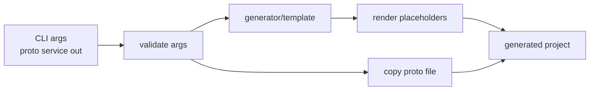

# 阶段 16：代码生成器与示例工程

阶段 16 的目标是让 MyTinyRPC 具备生成最小业务工程骨架的能力。当前先做模板复制和脚本验收，后续再逐步接入 proto service/method 识别和生成工程端到端运行。

## 任务七十九：生成器 CLI 和模板复制

已完成能力：

- 新增 `generator/tinyrpc_generator.py`。
- 生成器支持 `--proto`、`--service` 和 `--out` 三个必填参数。
- 输出目录不存在时会自动创建。
- 参数错误会输出明确的 `[generator] FAIL: ...` 提示并返回非零退出码。
- 新增 `generator/template/` 固定模板，生成 `conf.xml`、`main.cc`、`server.h`、`server.cc`、`client.cc`、`run.sh` 和 `shutdown.sh`。
- 生成器会把 proto 文件复制到输出目录，并替换模板中的服务名和 proto 文件名占位符。
- 新增 `scripts/check_generator.sh`，验证模板复制、关键占位符替换和非法 proto 参数错误提示。

当前生成链路：



验证命令：

```bash
./scripts/check_generator.sh
./build.sh
./scripts/check_rpc_sync.sh
```

当前边界：

- 当前只复制固定模板，不解析 proto service/method。
- 当前模板是最小工程骨架，不编译成独立业务工程。
- 当前不做多语言生成。
