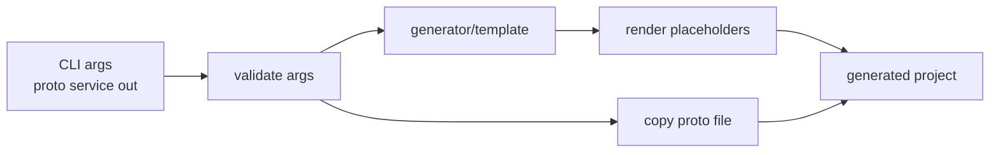
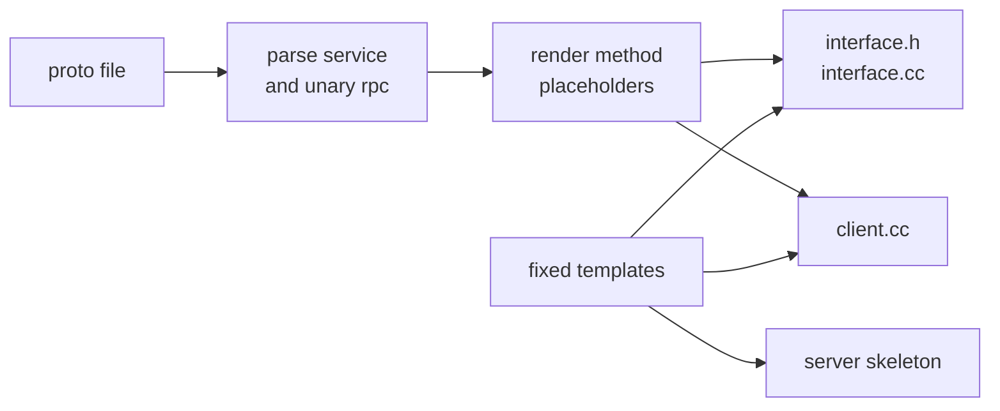

# 阶段 16：代码生成器与示例工程

阶段 16 的目标是让 MyTinyRPC 具备生成最小业务工程骨架的能力。当前已经支持模板复制、简单 proto service/method 识别、业务接口骨架生成，以及生成工程的构建、启动、调用和关闭验收。

## 任务七十九：生成器 CLI 和模板复制

已完成能力：

- 新增 `generator/tinyrpc_generator.py`。
- 生成器支持 `--proto`、`--service` 和 `--out` 三个必填参数。
- 输出目录不存在时会自动创建。
- 参数错误会输出明确的 `[generator] FAIL: ...` 提示并返回非零退出码。
- 新增 `generator/template/` 固定模板，生成 `conf.xml`、`main.cc`、`server.h`、`server.cc`、`client.cc`、`run.sh` 和 `shutdown.sh`。
- 生成器会把 proto 文件复制到输出目录，并替换模板中的服务名和 proto 文件名占位符。
- 新增 `scripts/check_generator.sh`，验证模板复制、关键占位符替换和非法 proto 参数错误提示。

当前生成链路：



验证命令：

```bash
./scripts/check_generator.sh
./build.sh
./scripts/check_rpc_sync.sh
```

当前边界：

- 当前模板是最小工程骨架，不编译成独立业务工程。
- 当前不做多语言生成。

## 任务八十：proto service/method 骨架生成

已完成能力：

- 生成器会读取简单 proto 中的 `service` 块，并校验 `--service` 指定的服务存在。
- 生成器会识别一元 `rpc method(Request) returns (Response);` 声明。
- 新增 `interface.h` 和 `interface.cc` 模板，生成继承 Protobuf service 的业务实现占位类。
- `client.cc` 模板会生成对应 `<Service>_Stub` 调用函数，并为每个方法创建 request/response 占位对象。
- `scripts/check_generator.sh` 扩展为任务八十验收：校验生成文件、关键方法签名、非法 service 提示，并用 `protoc` + `g++` 编译生成的 proto、接口骨架和客户端骨架。

当前生成链路：



验证命令：

```bash
./scripts/check_generator.sh
./build.sh
./scripts/check_rpc_sync.sh
```

当前边界：

- 只支持简单 service block 和一元 rpc method，不实现完整 Protobuf parser。
- 当前测试 proto 无 package；生成器暂不展开复杂命名空间场景。

## 任务八十一：生成工程端到端验收

已完成能力：

- 新增 `CMakeLists.txt` 模板，生成工程可以通过 `MYTINYRPC_ROOT` 复用当前 MyTinyRPC 源码并构建独立 server/client。
- 新增 `README.md` 模板，记录生成工程的构建、运行和关闭方式。
- `main.cc` 模板接入 `InitConfig()`、`StartRpcServer()` 和 `REGISTER_SERVICE()`，生成 server 可启动真实 TinyPB 服务。
- `client.cc` 模板接入 `TinyPbRpcChannel`，生成 client 可通过 Protobuf Stub 调用生成服务。
- `run.sh` 会启动 server、写入 pid 文件、等待端口可连接；`shutdown.sh` 会按 pid 停止 server。
- 新增 `scripts/check_generator_project.sh`，自动完成生成、配置、构建、启动、客户端调用和关闭。

端到端验收链路：


验证命令：

```bash
./scripts/check_generator_project.sh
./scripts/check_generator.sh
./build.sh
./scripts/check_rpc_sync.sh
```

当前边界：

- 生成工程依赖本地 MyTinyRPC 源码，通过 `MYTINYRPC_ROOT` 指定，不是发布级独立源码包。
- 生成业务实现仍是占位逻辑，默认返回空 proto3 response。
- `shutdown.sh` 使用 pid 文件停止阻塞式 server，框架层暂未提供 `TcpServer::stop()`。
