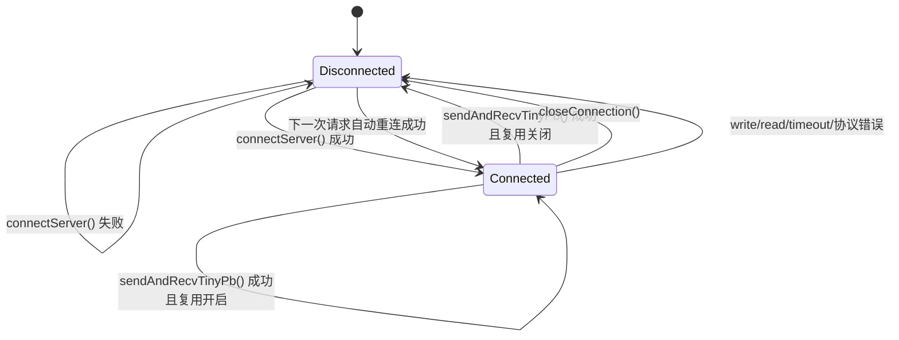

# 阶段 20：TcpClient Reactor 化和客户端连接语义补全

阶段 20 的目标是把同步 `TcpClient` 从临时 `poll()` 等待模型补成客户端侧
`TcpConnection` + `Reactor` + `Timer` 的连接模型。同步调用仍保持一问一答，
但连接对象已经具备输入输出缓冲、TinyPB 编解码和按 `reqId` 缓存响应的能力。

## 已完成能力

- `TcpConnection` 支持 `ClientConnection` 类型，客户端连接保存 peer address、input buffer、output buffer、codec 和 `reqId -> TinyPbStruct` 响应缓存。
- `TcpClient` 通过客户端 `TcpConnection` 编码请求、写出输出缓冲、读取输入缓冲并按 `reqId` 获取响应。
- `TcpClient` 的 connect/read/write 超时通过当前线程 `Reactor` 和一次性 `TimerTask` 驱动，不再依赖 `poll()`。
- 同步 `sendAndRecvTinyPb()` 会等待当前请求 `reqId` 对应的响应；先到的未知 `reqId` 响应不会让当前调用成功。
- 默认复用已连接 fd；调用 `setReuseConnection(false)` 后，每次同步请求完成后主动关闭连接。
- 网络失败、超时、协议错误和对端关闭后会关闭当前连接，下一次请求重新创建 fd。

## 连接状态机

## 错误后的连接策略

| 场景 | 错误码 | 连接状态 | 后续行为 |
|---|---:|---|---|
| connect 失败 | `ERROR_TCP_CONNECT_FAILED` | 未连接 | 按配置重试；最终失败后保持未连接 |
| connect/read/write 超时 | `ERROR_TCP_TIMEOUT` | 关闭 | 下一次请求重新建连 |
| 写失败或对端 RST | `ERROR_TCP_SEND_FAILED` | 关闭 | 下一次请求重新建连 |
| 读失败或对端关闭 | `ERROR_TCP_RECV_FAILED` | 关闭 | 下一次请求重新建连 |
| TinyPB 响应超过最大长度 | 0，错误信息描述协议错误 | 关闭 | 防止复用脏 buffer |
| 未知 `reqId` 响应 | 无直接错误 | 保持当前连接 | 丢弃或缓存后继续等待当前 `reqId` |

## Public API 行为

- `setTimeout(timeoutMs)`：`timeoutMs > 0` 时，connect/read/write 等待使用当前线程 `Reactor` 的 Timer；没有当前 Reactor 时，`TcpClient` 内部创建一个私有 Reactor。
- `setConnectRetry(retryCount, retryIntervalMs)`：仅覆盖连接建立失败后的有限重试，不重试已发出的请求。
- `setReuseConnection(enabled)`：默认 `true`。设为 `false` 时，`sendAndRecvTinyPb()` 每次完成后关闭连接。
- `closeConnection()`：幂等，清理 fd、`FdEvent`、客户端连接对象、输入输出缓冲和响应缓存。
- `sendAndRecvTinyPb(request, response)`：发送请求后把 `request.m_reqId` 作为响应匹配条件；只有匹配响应会写入 `response`。

## 当前限制

- 同步客户端仍只支持单个 in-flight 请求，不支持并发请求。
- 不实现连接池、多目标地址池或负载均衡。
- 不实现异步 RPC pending map；阶段 21 会继续补真实异步网络路径。
