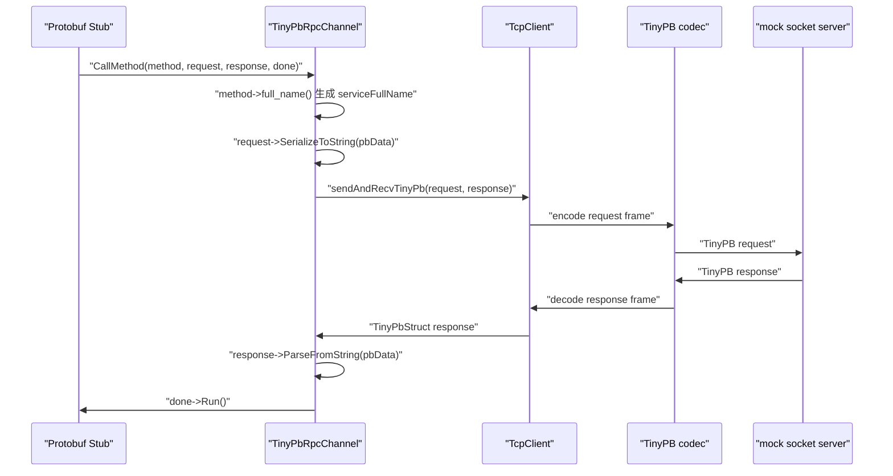
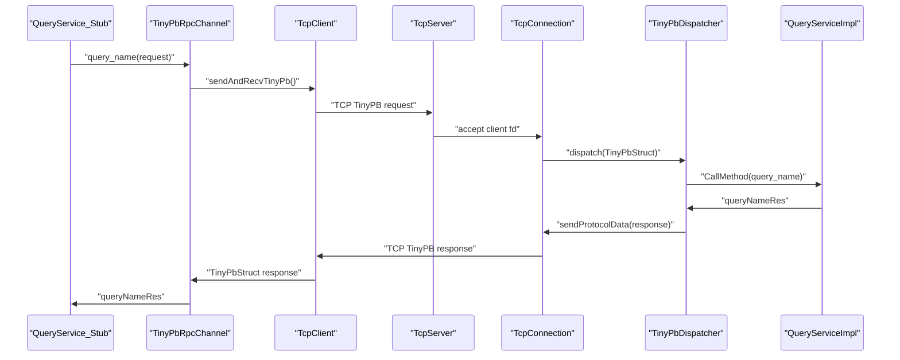

# 阶段 8：同步 RPC 客户端闭环

阶段 8 的目标是把“手写 `TinyPbStruct` 收发”推进到“Protobuf 生成的 Stub 可以通过 `TinyPbRpcChannel` 发起同步网络调用”。

## 当前进度

### 任务三十八：最小 `TinyPbRpcChannel`

已新增 `TinyPbRpcChannel`，它继承 `google::protobuf::RpcChannel`，作为 Protobuf Stub 与 TinyPB/TcpClient 之间的同步适配层。

当前调用链如下：



## 错误语义

`TinyPbRpcController` 现在可以记录框架层错误码、错误文本和本次请求号。`TinyPbRpcChannel` 在以下失败路径中设置 controller：

- 参数非法：`ERROR_RPC_CHANNEL_INVALID_ARGUMENT`
- Protobuf request 序列化失败：`ERROR_FAILED_SERIALIZE`
- TCP/TinyPB 网络收发失败：`ERROR_RPC_CHANNEL_NETWORK`
- 服务端 TinyPB 错误响应：沿用 response 中的 `m_errCode` 和 `m_errInfo`
- Protobuf response 反序列化失败：`ERROR_FAILED_DESERIALIZE`

业务错误仍应由业务 response 字段表达，不放入 `RpcController`。

## 当前限制

- 仅支持同步一问一答调用。
- 不支持超时、重试、连接池和并发 pending map。
- 不检查响应 `msgReq` 是否与请求一致，该能力在任务四十/四十六补齐。
- 本任务只使用 mock socket server 验证 Channel，不启动真实 `TcpServer`。

### 任务三十九：真实 Stub 到服务端端到端同步 RPC

已新增 `test_tinypb_server_client` 和 `scripts/check_stage8_rpc.sh`。同一个测试程序提供三种模式：

- `--server <port>`：启动真实 `TcpServer`，注册 `QueryServiceImpl`。
- `--probe <port>`：尝试连接服务端端口，供脚本等待服务就绪。
- `--client <port>`：使用 `QueryService_Stub` 和 `TinyPbRpcChannel` 发起一次同步 RPC。

端到端调用链如下：



验收命令：

```bash
./build.sh
./scripts/check_stage8_rpc.sh
./scripts/check_stage1.sh
```

### 任务四十：请求号与 `TinyPbRpcController` 语义补齐

已新增统一请求号工具 `MsgReqUtil::genMsgNumber()`。默认请求号格式为进程内唯一字符串，Channel 测试仍可通过 `setMsgReqGenerator()` 注入固定请求号，便于断言。

`TinyPbRpcController` 当前记录以下框架层状态：

- `MsgReq()`：本次 RPC 的请求号。
- `ErrorCode()` / `ErrorText()`：框架层错误码和错误文本。
- `Timeout()`：同步 RPC 超时时间占位，单位毫秒，真正超时行为留到任务四十一。

`TinyPbRpcChannel` 的请求号规则：

1. 如果传入的是 `TinyPbRpcController`，且 controller 已设置 `MsgReq()`，则直接复用该请求号。
2. 否则调用 `MsgReqUtil::genMsgNumber()` 自动生成请求号。
3. 收到 response 后先检查 response `msgReq` 是否等于 request `msgReq`。
4. 不匹配时设置 `ERROR_RPC_MSGREQ_MISMATCH`，不会反序列化业务 response。

验证命令：

```bash
./build.sh
./build/test_msg_req
./build/test_tinypb_rpc_channel
./scripts/check_stage8_rpc.sh
```

### 任务四十一：同步客户端超时与失败路径

`TcpClient` 已支持最小同步超时语义：

- `setTimeout(timeoutMs)` 设置 connect/read/write 等待超时时间，单位毫秒。
- `getErrorCode()` 返回最近一次网络操作的框架错误码。
- connect 超时时使用非阻塞 `connect()` + `poll(POLLOUT)` 等待。
- read/write 在系统调用前使用 `poll(POLLIN/POLLOUT)` 等待 fd 就绪。
- `timeoutMs <= 0` 时保持阻塞等待语义。

新增错误码：

- `ERROR_TCP_CONNECT_FAILED`：连接建立失败。
- `ERROR_TCP_SEND_FAILED`：写入失败。
- `ERROR_TCP_RECV_FAILED`：读取失败或对端提前关闭。
- `ERROR_TCP_TIMEOUT`：同步等待超时。

`TinyPbRpcChannel` 会把 `TinyPbRpcController::Timeout()` 传递给内部 `TcpClient`。如果 TcpClient 返回明确错误码，Channel 会把该错误码写入 controller；否则才使用泛化的 `ERROR_RPC_CHANNEL_NETWORK`。

验证命令：

```bash
./build.sh
./build/test_tcp_client
./build/test_tinypb_rpc_channel
./scripts/check_stage8_rpc.sh
```

## 验证命令

```bash
./build.sh
./build/test_tinypb_rpc_channel
./build/test_tinypb_codec
./build/test_tinypb_dispatcher
./build/test_tcp_client
```
