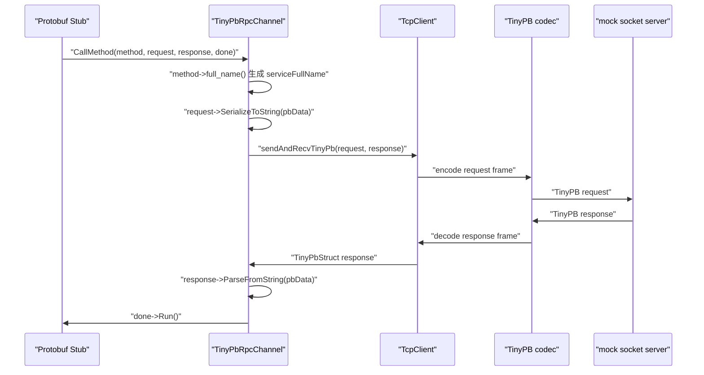

# 阶段 8：同步 RPC 客户端闭环

阶段 8 的目标是把“手写 `TinyPbStruct` 收发”推进到“Protobuf 生成的 Stub 可以通过 `TinyPbRpcChannel` 发起同步网络调用”。

## 当前进度

### 任务三十八：最小 `TinyPbRpcChannel`

已新增 `TinyPbRpcChannel`，它继承 `google::protobuf::RpcChannel`，作为 Protobuf Stub 与 TinyPB/TcpClient 之间的同步适配层。

当前调用链如下：



## 错误语义

`TinyPbRpcController` 现在可以记录框架层错误码、错误文本和本次请求号。`TinyPbRpcChannel` 在以下失败路径中设置 controller：

- 参数非法：`ERROR_RPC_CHANNEL_INVALID_ARGUMENT`
- Protobuf request 序列化失败：`ERROR_FAILED_SERIALIZE`
- TCP/TinyPB 网络收发失败：`ERROR_RPC_CHANNEL_NETWORK`
- 服务端 TinyPB 错误响应：沿用 response 中的 `m_errCode` 和 `m_errInfo`
- Protobuf response 反序列化失败：`ERROR_FAILED_DESERIALIZE`

业务错误仍应由业务 response 字段表达，不放入 `RpcController`。

## 当前限制

- 仅支持同步一问一答调用。
- 不支持超时、重试、连接池和并发 pending map。
- 不检查响应 `msgReq` 是否与请求一致，该能力在任务四十/四十六补齐。
- 本任务只使用 mock socket server 验证 Channel，不启动真实 `TcpServer`。

## 验证命令

```bash
./build.sh
./build/test_tinypb_rpc_channel
./build/test_tinypb_codec
./build/test_tinypb_dispatcher
./build/test_tcp_client
```
