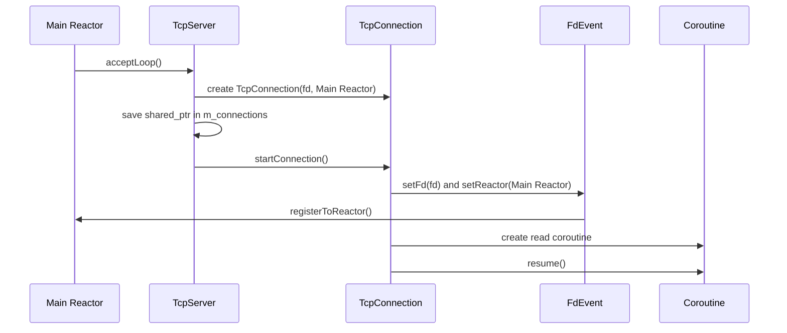
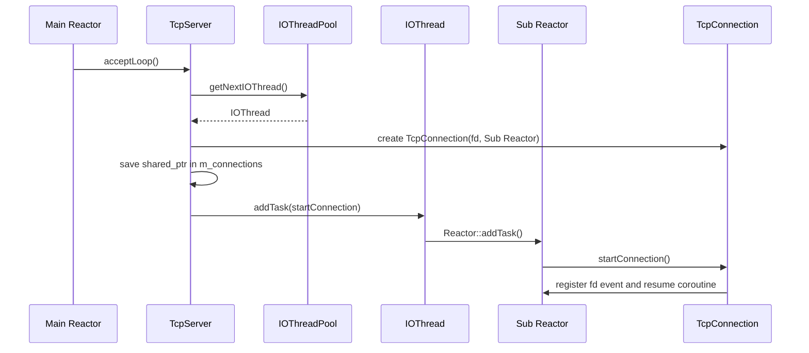
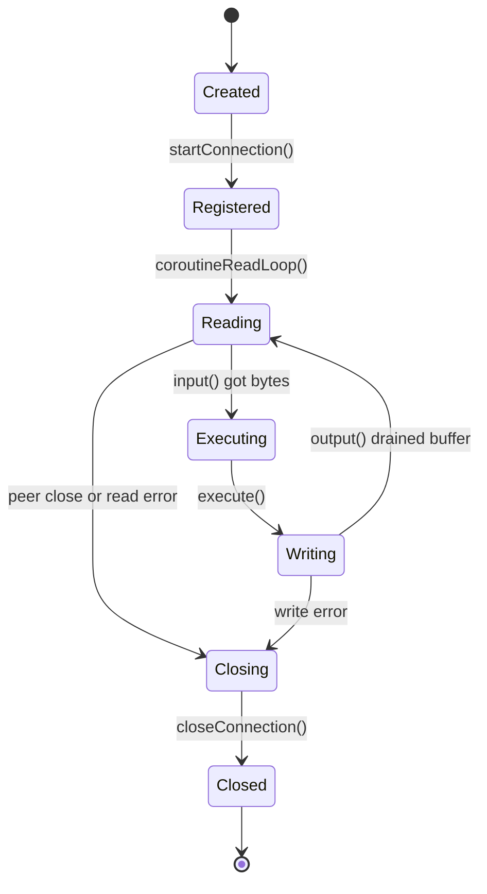
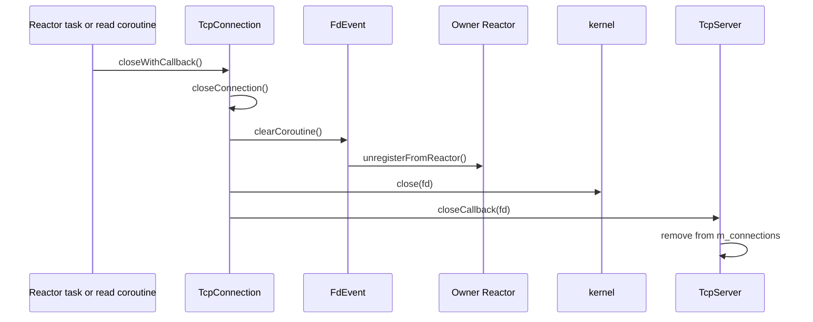
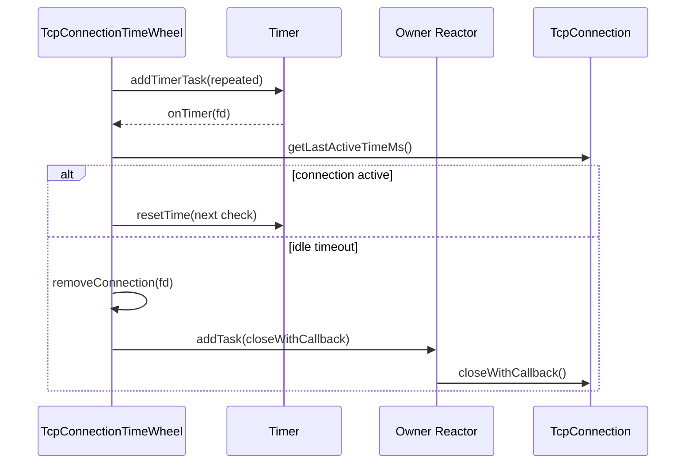

# TcpConnection 生命周期调试文档

本文记录阶段 11 结束时 `TcpConnection` 在单 Reactor 和多 Reactor 两种模式下的对象所有权、fd 归属、读写状态机、关闭路径和线程归属。排查多线程问题时，应优先确认当前连接所属的 Reactor，再判断对象是否还被 `TcpServer::m_connections`、协程或投递任务持有。

## 一、对象、fd 和组件归属

| 对象或资源 | 拥有者 | 说明 |
| --- | --- | --- |
| `TcpConnection` 对象 | `TcpServer::m_connections` 中的 `std::shared_ptr<TcpConnection>` | 连接建立后先写入连接表；关闭回调调用 `TcpServer::removeConnection()` 后释放服务端持有的引用。 |
| 连接 fd | `TcpConnection` | fd 从 `accept(2)` 返回后交给 `TcpConnection` 管理，最终由 `TcpConnection::closeConnection()` 调用 `close(2)` 关闭。 |
| `FdEvent` | `TcpConnection` | `FdEvent` 只保存 fd、等待事件、回调和协程指针，不拥有 fd；注册到 Reactor 后 Reactor 只保存非拥有的 `FdEvent*`。 |
| input buffer | `TcpConnection` | `input()` 通过 `readHook()` 读入字节流并追加，`execute()` 通过 codec 消费。 |
| output buffer | `TcpConnection` | `execute()`、dispatcher 或 `sendProtocolData()` 写入，`output()` 通过 `writeHook()` 发送并推进读指针。 |
| codec | `TcpConnection` 持有 `shared_ptr` | 负责把 input buffer 解码成协议对象，并把响应对象编码到 output buffer。 |
| dispatcher | `TcpConnection` 持有 `shared_ptr` | 只分发协议对象和生成响应，不拥有连接、fd 或缓冲区。 |
| IOThread / IOThreadPool | `TcpServer` | 只拥有 Sub Reactor 线程，不拥有连接对象；连接只记录自己所属的 `Reactor*`。 |

当前没有内存池优化，连接对象生命周期完全依赖 `shared_ptr`、协程捕获和关闭回调。

## 二、连接创建和注册线程归属

### 单 Reactor 模式

未调用 `TcpServer::setIOThreadNum()` 或线程数为 0 时，监听 fd 和连接 fd 都由 Main Reactor 驱动。

线程归属：

- `acceptLoop()` 在 Main Reactor 线程执行。
- `TcpConnection` 创建、`m_connections` 写入和 `startConnection()` 都在 Main Reactor 线程执行。
- 后续读、写、dispatcher 调用和关闭也都在 Main Reactor 线程执行。

### 多 Reactor 模式

调用 `TcpServer::setIOThreadNum(n)` 且 `n > 0` 后，Main Reactor 只负责监听 fd 和 accept；每条新连接按 round-robin 选择一个 IOThread，并在该 IOThread 的 Sub Reactor 中注册读写事件。

线程归属：

- `acceptLoop()`、`TcpConnection` 创建和连接表写入仍在 Main Reactor 线程执行。
- `startConnection()` 通过 `IOThread::addTask()` 投递到目标 Sub Reactor 线程执行。
- fd 注册、读写协程、codec、dispatcher、关闭动作都在连接所属 Sub Reactor 线程执行。
- `m_connections` 同时可能被 Main Reactor 写入、Sub Reactor 删除，因此使用 `Mutex` 保护。

## 三、读写状态机

读写主循环只在连接所属 Reactor 线程中运行：

1. `input()` 调用 `readHook()`。当内核返回 `EAGAIN` 时，hook 会把当前协程挂到 `FdEvent`，注册 `EPOLLIN` 并 yield；Reactor 之后在同一线程恢复协程。
2. `input()` 读到真实数据后追加到 input buffer，并刷新 `m_lastActiveTimeMs`。
3. `execute()` 消费 input buffer。无 codec 时保持 Echo；有 codec 时循环 decode，decode 成功后交给 dispatcher 或直接 encode 回写。
4. dispatcher 在连接所属 Reactor 线程中执行。dispatcher 可通过 `TcpConnection::sendProtocolData()` 把响应编码进 output buffer，但不拥有连接对象。
5. `output()` 调用 `writeHook()` 发送 output buffer。遇到 `EAGAIN` 时注册 `EPOLLOUT` 并 yield，后续仍由同一 Reactor 线程恢复。
6. output buffer 写空后删除 `EPOLLOUT`，避免持续可写事件造成空转。

缓冲区关系：

- input buffer 是网络输入暂存区，只由连接读协程追加和 `execute()` 消费。
- output buffer 是待发送响应暂存区，只由 `sendData()`、`sendProtocolData()`、dispatcher 或 encode 阶段追加，由 `output()` 消费。
- 当前连接内部未做跨线程 buffer 保护，因为设计上同一连接的读写状态机只由所属 Reactor 线程串行驱动。

## 四、关闭和析构路径

关闭边界：

- `closeConnection()` 幂等，`m_isClosed` 或无效 fd 会直接返回。
- 关闭前先清理 `FdEvent` 上的协程指针，再从 Reactor 删除事件，最后调用 `close(2)`。
- `closeWithCallback()` 先关闭 fd，再调用上层 close callback 删除连接表记录。
- 删除连接表记录时可能发生在 Sub Reactor 线程，因此 `TcpServer::removeConnection()` 必须加锁。
- 析构函数兜底调用 `closeConnection()`。析构实际发生在哪个线程，取决于最后一个 `shared_ptr` 在哪里释放；正常关闭路径期望最后释放发生在连接所属 Reactor 线程，但析构仍依赖 `closeConnection()` 幂等保证不会重复关 fd。

## 五、空闲超时路径

空闲超时边界：

- `TcpConnectionTimeWheel` 保存 `weak_ptr<TcpConnection>`，不拥有连接。
- 每条连接一个重复 `TimerTask`，当前不做复杂 bucket 时间轮。
- 超时检查由对应 Timer 触发，真正关闭通过连接所属 `Reactor::addTask()` 执行，避免跨线程直接关闭 fd。
- 当前 `TcpServer` 仍未默认接入空闲超时管理；该路径作为阶段 10 能力保留，后续统一接入服务端生命周期。

## 六、排查清单

- 连接对象由谁持有：主要由 `TcpServer::m_connections` 保存 `shared_ptr`，读协程和投递任务会临时捕获 `shared_ptr` 保活。
- fd 由谁关闭：由 `TcpConnection::closeConnection()` 关闭。
- fd event 由谁删除：由 `TcpConnection::closeConnection()` 通过 `FdEvent::unregisterFromReactor()` 从所属 Reactor 删除。
- 回调在哪个线程执行：listen fd 的 accept 回调在 Main Reactor 线程；连接读写协程、codec、dispatcher 和 close callback 在连接所属 Reactor 线程执行。
- 连接表为什么要加锁：多 Reactor 模式下 Main Reactor 写入连接表，Sub Reactor 可在关闭回调中删除连接表。
- 析构在哪个线程执行：最后一个 `shared_ptr` 释放所在的线程；正常关闭时应围绕连接所属 Reactor 线程释放，析构兜底关闭必须保持幂等。
- idle timeout 在哪个线程关闭：Timer 检查后通过连接所属 Reactor task 关闭 fd。
