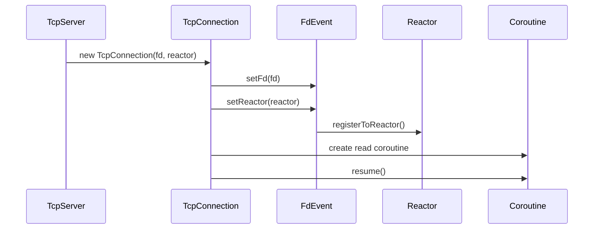
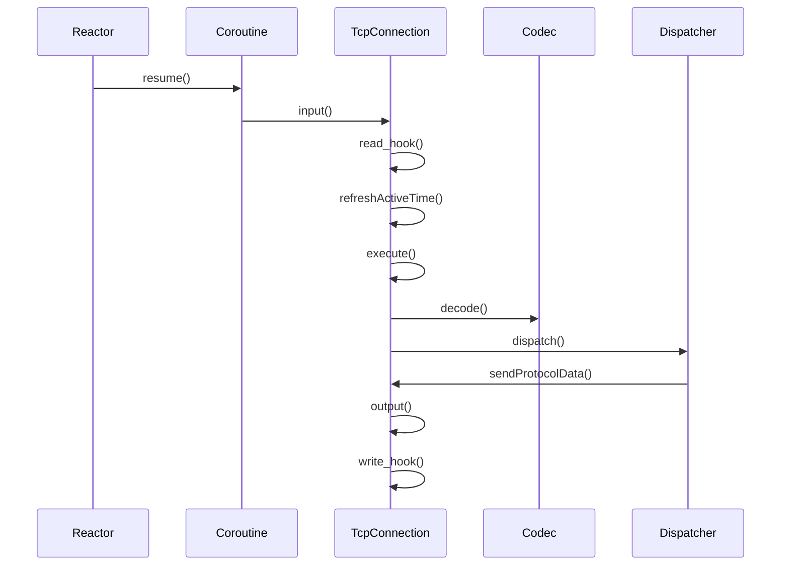
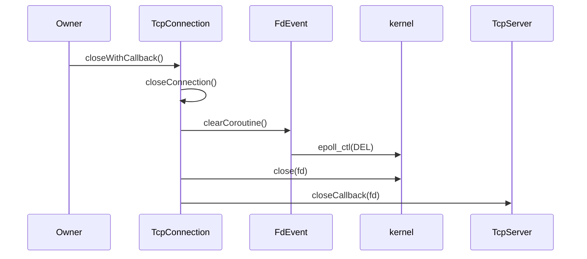
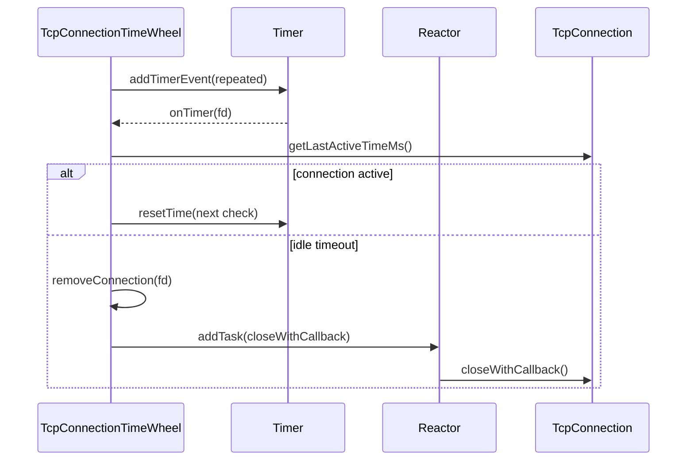

# TcpConnection 生命周期调试文档

本文记录阶段 10 结束时 `TcpConnection` 的创建、读写、关闭和空闲超时路径。后续接入 IOThreadPool 和多 Reactor 时，应以本文作为线程归属基线。

## 一、对象和 fd 归属

- `TcpConnection` 持有连接 fd、`FdEvent`、输入缓冲区、输出缓冲区、codec 和 dispatcher。
- `TcpServer` 当前用 `std::shared_ptr<TcpConnection>` 保存连接对象。
- `FdEvent` 不拥有 fd；fd 最终由 `TcpConnection::closeConnection()` 关闭。
- `Reactor` 不拥有 `TcpConnection`，只保存 `FdEvent*` 用于事件触发。

## 二、连接启动路径

启动边界：

- `startConnection()` 要求 `Reactor*` 非空。
- 注册失败时连接不会进入正常读写流程。
- 读写协程持有 `shared_from_this()`，避免协程运行中连接被提前释放。

## 三、读写处理路径

读写边界：

- `input()` 读到真实数据后刷新最近活跃时间。
- 无 codec 时保持 Echo 语义。
- 有 codec 时循环 decode，半包或非法包暂不消费剩余 buffer。
- `output()` 写空输出缓冲区后删除 `EPOLLOUT`，避免持续可写触发。

## 四、关闭路径

关闭边界：

- `closeConnection()` 幂等，重复调用不会重复关闭 fd。
- 关闭前先清理协程指针，避免 Reactor 恢复已废弃协程。
- 关闭前先从 Reactor 删除事件，再调用 `close(2)`。
- `closeWithCallback()` 会在关闭后通知上层移除连接记录。

## 五、空闲超时路径

空闲超时边界：

- `TcpConnectionTimeWheel` 保存 `weak_ptr<TcpConnection>`，不拥有连接。
- 每条连接一个重复 `TimerEvent`，当前不做复杂 bucket 时间轮。
- 超时关闭通过 `Reactor::addTask()` 执行，避免跨线程直接关闭 fd。
- 当前 `TcpServer` 尚未默认接入空闲超时，后续多 Reactor 阶段统一接入。

## 六、排查清单

- 连接对象由谁持有：当前由 `TcpServer::m_connections` 保存 shared_ptr。
- fd 由谁关闭：由 `TcpConnection::closeConnection()` 关闭。
- fd event 由谁删除：由 `TcpConnection::closeConnection()` 通过 `FdEvent::unregisterFromReactor()` 删除。
- read/write callback 在哪个线程：当前由 Reactor 恢复协程，协程逻辑在 Reactor 线程继续执行。
- idle timeout 在哪个线程关闭：Timer 检查在 Reactor 线程，关闭动作也通过 Reactor task 执行。
