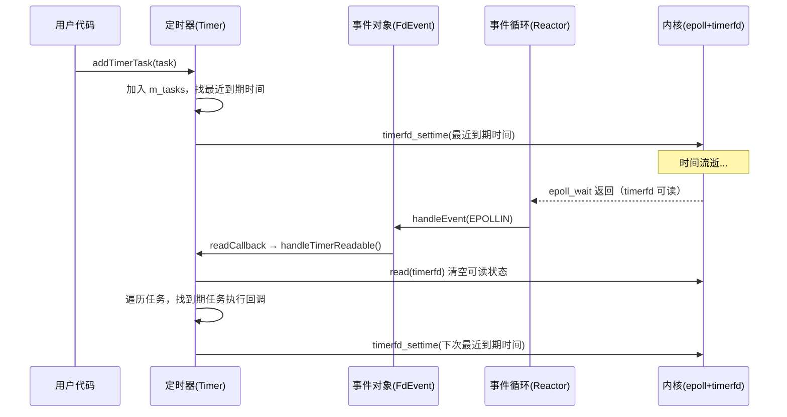

# 定时器实现机制详解

本文系统讲解当前项目（mytinyrpc）是如何实现定时功能的。从最底层的内核机制（timerfd）讲到上层的 `TimerTask`，把整个调用链一次性讲清楚。

## 一、整体思路：把"时间"变成"fd 可读事件"

项目里所有 IO（socket、eventfd、timerfd）都统一交给 epoll 管理。但 epoll 本身只关心 **fd 上的事件**，并不直接关心"时间到了没"。

Linux 提供了一个非常巧妙的机制 `timerfd`：

> timerfd 把"某个时间点到了"这件事，转换成"一个 fd 变得可读"。

这样一来，定时器和普通 socket 就完全一样了：

- 普通客户端连接：socket 收到数据 → fd 可读 → epoll 通知 → 回调处理
- 定时任务：定时时间到了 → timerfd 可读 → epoll 通知 → 回调处理

整个项目根本不需要单独开一个线程去 `sleep`，也不需要 `select` 的超时参数——所有"等时间"的工作都丢给内核和 epoll，应用层只在事件到来时被唤醒。

## 二、三个核心对象的分工

| 对象 | 职责 | 是否拥有 fd |
|---|---|---|
| `TimerTask` | 描述一个具体的定时任务（多久后执行、是否循环、回调函数是什么） | 否，纯内存对象 |
| `Timer` | 管理 timerfd + 维护所有 `TimerTask` 列表，到期时统一触发 | 是，持有 timerfd |
| `Reactor` | 持有 epoll 实例，把 Timer 的 fd 注册进来，在事件循环里分发事件 | 间接（通过 Timer） |

简单说：用户创建 `TimerTask` 丢给 `Timer`，`Timer` 用 timerfd 让 epoll 在合适的时间被唤醒，醒来后遍历所有任务找出已到期的执行回调。

## 三、底层基石：timerfd 是怎么工作的

### 3.1 创建 timerfd

```cpp
m_timerFd = timerfd_create(CLOCK_MONOTONIC, TFD_NONBLOCK | TFD_CLOEXEC);
```

参数含义：

- `CLOCK_MONOTONIC`：使用**单调时钟**（从系统启动开始计），不受人为改系统时间影响。如果用 `CLOCK_REALTIME`，用户把时间往回调就会导致定时器乱套。
- `TFD_NONBLOCK`：read 时如果没数据可读，立刻返回 `EAGAIN` 而不是阻塞。
- `TFD_CLOEXEC`：exec 时自动关闭 fd，避免泄漏到子进程。

### 3.2 设置定时时间

```cpp
timerfd_settime(m_timerFd, 0, &spec, nullptr);
```

- 第二个参数 `flags = 0` 表示用**相对时间**（"从现在起 N 毫秒后"）。
- `spec.it_value` 是定时时间；如果设成 0，表示**取消当前定时**。
- `spec.it_interval` 是周期重复间隔（本项目没用到，因为周期性由 `TimerTask::isRepeated` 自己管）。

### 3.3 timerfd 到期时会发生什么

内核在到期时，**把一个 8 字节无符号整数塞进 fd**，这个整数表示"自上次 read 以来过期了多少次"。然后 fd 变为可读，epoll 立刻被唤醒。

读取它：

```cpp
uint64_t expirations = 0;
read(m_timerFd, &expirations, sizeof(expirations));
```

**关键：必须 read，否则 fd 永远保持可读状态，epoll 会持续疯狂唤醒（水平触发模式）。** 这就是为什么 `handleTimerReadable()` 一进来就要先把 fd 读干净。

## 四、整体调用链全景



## 五、`Timer` 内部做了什么

### 5.1 构造：把 timerfd 注册进 epoll

```cpp
Timer::Timer(Reactor *reactor) {
    m_timerFd = timerfd_create(CLOCK_MONOTONIC, TFD_NONBLOCK | TFD_CLOEXEC);
    m_fdEvent.setFd(m_timerFd);
    m_fdEvent.setReactor(reactor);
    m_fdEvent.addListenEvent(EPOLLIN);
    m_fdEvent.setReadCallback([this]() { handleTimerReadable(); });
    m_fdEvent.registerToReactor();
}
```

把 timerfd 包装成一个普通的 `FdEvent`，监听 `EPOLLIN`，回调指向 `handleTimerReadable()`。从 Reactor 的角度看，Timer 跟一个普通的读 fd 没有任何区别。

### 5.2 添加任务：`addTimerTask`

```cpp
bool Timer::addTimerTask(const std::shared_ptr<TimerTask>& task) {
    // 去重，加入 m_tasks
    auto it = std::find(m_tasks.begin(), m_tasks.end(), task);
    if (it == m_tasks.end()) {
        m_tasks.push_back(task);
    }
    resetTimerFd();   // 重新对准最近到期时间
    return true;
}
```

任务本身**不会创建 timerfd**（一个 Timer 始终只有一个 timerfd）。所有任务共用一个 fd，靠 `resetTimerFd()` 把 timerfd 对准"最早到期的那个任务"。

### 5.3 `resetTimerFd`：把 timerfd 对准最早的任务

```cpp
void Timer::resetTimerFd() {
    if (m_tasks.empty()) {
        // spec 全 0 → 取消定时
        timerfd_settime(m_timerFd, 0, &spec, nullptr);
        return;
    }
    // 找出最早到期的任务
    auto it = std::min_element(...);
    int64_t delayMs = (*it)->getExpireTimeMs() - getNowMs();
    spec.it_value.tv_sec  = delayMs / 1000;
    spec.it_value.tv_nsec = (delayMs % 1000) * 1000 * 1000;
    timerfd_settime(m_timerFd, 0, &spec, nullptr);
}
```

**核心思想：m_tasks 里可能有 N 个任务到期时间不同，但 timerfd 只有一个，所以永远只对准"最早"的那个。** 等这个最早的到期被唤醒后，再重新对准下一个最早的，如此循环。

### 5.4 `handleTimerReadable`：到期的核心处理

这是整个定时功能的"心脏"，被 epoll 在 timerfd 可读时回调：

```cpp
void Timer::handleTimerReadable() {
    // 1) 必须先 read，把 timerfd 的可读状态清掉，
    //    否则 epoll（水平触发）会一直唤醒
    uint64_t expirations = 0;
    while (true) {
        ssize_t n = read(m_timerFd, &expirations, sizeof(expirations));
        if (n == sizeof(expirations)) break;               // 成功读取
        if (n < 0 && (errno == EAGAIN || errno == EWOULDBLOCK)) break;  // 没数据了
        if (n < 0 && errno == EINTR) continue;              // 被信号打断，重试
        // 其它错误记日志后退出
        break;
    }

    // 2) 把任务分成"已到期"和"未到期"两堆
    int64_t nowMs = getNowMs();
    for (const auto& task : m_tasks) {
        if (task->isCanceled()) continue;
        if (task->isExpired(nowMs)) expiredTasks.push_back(task);
        else                          pendingTasks.push_back(task);
    }

    // 3) 已到期任务按到期时间排序，先到期的先执行
    std::sort(expiredTasks.begin(), expiredTasks.end(), ...);

    // 4) 用 pending 替换原列表（等于把已到期任务移出去）
    m_tasks.swap(pendingTasks);

    // 5) 执行到期任务的回调
    //    如果是周期任务，run() 内部会重新设置 expireTime，
    //    执行完未取消的话，再 push 回 m_tasks
    for (const auto& task : expiredTasks) {
        task->run();
        if (!task->isCanceled()) m_tasks.push_back(task);
    }

    // 6) 重新对准下一次最近到期时间
    resetTimerFd();
}
```

#### 关于那段 `read` 的 `while` 循环（之前问到的点）

`while` 循环存在的**真正目的**是为了处理 `EINTR`（被信号打断重试）。而对 timerfd 来说，epoll 通知可读了基本意味着肯定有数据，所以第一次 read 几乎都是 `n == 8` 直接退出。`EAGAIN` 分支只是非阻塞 read 模板的标准防御性写法，在 timerfd 场景下实际上几乎走不到——它只是保证在重试路径里万一没数据时能优雅退出，而不是死循环。

## 六、`TimerTask`：单个定时任务的描述

`TimerTask` 是纯内存对象，不持有任何 fd。它只描述"做什么、多久后做、是否循环、是否被取消"。

```cpp
class TimerTask {
    int64_t m_intervalMs;          // 间隔（毫秒）
    int64_t m_expireTimeMs;        // 绝对到期时间戳（now + interval）
    bool    m_repeated;            // 是否周期执行
    std::atomic<bool> m_canceled;  // 取消标记（跨线程安全）
    Callback m_callback;           // 到期时执行什么
};
```

关键方法：

| 方法 | 作用 |
|---|---|
| `isExpired(nowMs)` | 当前时间 ≥ 到期时间 → 返回 true |
| `cancel()` | 把 `m_canceled` 设为 true，下次遍历时被跳过 |
| `run()` | 执行回调；若是周期任务，自动 `resetTime()` 续上下一次 |
| `resetTime(intervalMs)` | 重新计算 `m_expireTimeMs = now + intervalMs`，并清掉 cancel 标记 |

`m_canceled` 用 `std::atomic<bool>`，因为业务方可能在另一个线程调用 `cancel()`，而 Timer 在 Reactor 线程读这个标记。

## 七、为什么不用 `std::this_thread::sleep_for` 或 `select` 超时

| 方案 | 缺点 |
|---|---|
| 单独线程 + `sleep` | 每个定时任务要一个线程，开销大；和 epoll 模型割裂 |
| `select/poll/epoll_wait` 的 timeout | 整个事件循环只有一个 timeout，难以支持任意多个不同间隔的任务 |
| `priority_queue` + 自己算 timeout | 逻辑复杂，且无法被 epoll 高效唤醒 |
| **本项目：timerfd** | 复用 epoll，统一事件源，内核帮你管时间 |

timerfd 方案的精妙之处在于：**它把时间变成了和 socket 完全等价的事件源**，整个 reactor 模型完全不需要为定时器做特殊处理。

## 八、使用示例（伪代码）

```cpp
Reactor reactor;                // 内部已经持有 Timer

// 1. 一次性任务：3 秒后执行一次
auto task1 = std::make_shared<TimerTask>(
    3000,                       // 间隔 3000ms
    false,                      // 不重复
    []() { /* 做点事 */ }
);
reactor.getTimer()->addTimerTask(task1);

// 2. 周期任务：每 1 秒执行一次
auto task2 = std::make_shared<TimerTask>(
    1000,
    true,
    []() { /* 心跳、统计等 */ }
);
reactor.getTimer()->addTimerTask(task2);

// 3. 取消任务
task2->cancel();                // 或 reactor.getTimer()->delTimerTask(task2);

reactor.loop();                 // 事件循环里 epoll 会按时唤醒
```

## 九、设计要点回顾

1. **一个 Timer 只有一个 timerfd**：所有任务共用，靠 `resetTimerFd` 始终对准最近到期任务。
2. **到期时必须 read fd**：否则水平触发的 epoll 会持续唤醒，CPU 100%。
3. **任务队列用 `std::vector` 而非 `priority_queue`**：实现简单，对小规模任务足够；每次到期后全量遍历分桶。
4. **cancel 用原子变量**：跨线程取消任务时不需要加锁。
5. **周期任务的"续期"在 `TimerTask::run()` 内部完成**：执行完回调后自动 `resetTime()`，Timer 只需把它重新 push 回 m_tasks。
6. **resetTimerFd 在每次添加、删除、批量触发后都调用**：保证 timerfd 始终对准"下一次该唤醒的时间点"。

## 十、相关代码索引

| 关注点 | 文件 |
|---|---|
| `Timer` 和 `TimerTask` 类定义 | `mytinyrpc/net/timer.h` |
| `Timer` 实现（含 `handleTimerReadable`/`resetTimerFd`） | `mytinyrpc/net/timer.cc` |
| `Reactor` 如何把 Timer 注册到 epoll | `mytinyrpc/net/reactor.h` / `reactor.cc` |
| `FdEvent`（Timer 内部用它包装 timerfd） | `mytinyrpc/net/fdevent.h` |
